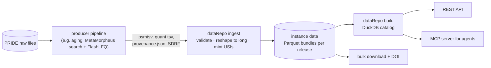

# dataRepo

**Software for an AI-ready repository of reanalyzed public proteomics data.**

dataRepo turns the search and quantification output of many reanalyzed PRIDE datasets into one set of
versioned, validated, queryable tables. It serves those tables to an agent over MCP, so
AI agents can answer questions like *"which mitochondrial proteins decline with age in skeletal muscle,
in how many datasets, and show me the spectra"*. People can use it too, but agents are the primary users.

[](https://github.com/trishorts/dataRepo/actions/workflows/ci.yml)
[](LICENSE)

> **Status: v0, pre-alpha.** The schema is drafted and validated but not locked, and `datarepo ingest`
> is the only working command. There is no query catalog and no server yet. Expect breaking changes.
> See the [roadmap](#roadmap).

---

## This repository is code, not data

dataRepo is **software**. The **data** lives in an *instance* run by the project that produced it:

| | Lives in | Owned by |
|---|---|---|
| Schema, ingester, API/MCP server, deploy package, docs | **this repo** | dataRepo |
| Parquet bundles, releases, DOIs, the running service | the producing project's instance | e.g. [aging](https://github.com/trishorts/aging) |
| Raw spectra | PRIDE / ProteomeXchange | the original submitters |

The first instance is the **NCEMS aging proteome** project (`aging`), which reanalyzes PRIDE datasets to
ask how organelle proteomes change with age. The core schema doesn't mention aging: aging adds its
tables as a [study layer](#core-and-study-layers). Any reanalysis project can do the same.



dataRepo **stores and serves**. It never re-runs a search or computes science. Statistics, organelle
maps and metric definitions come from the projects that own them ([ownership](#who-owns-what)).

## What's here

| Path | What it is |
|---|---|
| [`schema/datarepo.yaml`](schema/datarepo.yaml) | The **core schema** (LinkML): 27 tables, generic to any bottom-up reanalysis |
| [`schema/study/aging.yaml`](schema/study/aging.yaml) | The **aging study layer**: sample age, age effects, organelle summaries, clocks |
| [`docs/schema/core.md`](docs/schema/core.md) | **Schema reference**: every table, column, type and vocabulary, plus a relationship diagram. Generated. |
| [`docs/schema/study-aging.md`](docs/schema/study-aging.md) | Reference for the aging layer. Generated. |
| [`docs/architecture.md`](docs/architecture.md) | How the pieces fit, and which parts are decided vs. proposed |
| [`examples/`](examples/) | A minimal valid bundle, real ingester output, and an invalid one that must fail |
| [`src/datarepo/`](src/datarepo/) | The **ingester**: `datarepo ingest` turns a producer's run into a Parquet bundle |
| [`docs/ingest.md`](docs/ingest.md) | **Ingester reference**: the manifest contract, what it reads, what it writes, how counts reconcile |
| [`docs/mcp.md`](docs/mcp.md) | **MCP server reference**: the three tools, the provenance every answer carries, what the sandbox does and does not do |
| [`tests/`](tests/) | Test suite with a miniature producing instance in `tests/data/` |
| [`tools/build_docs.py`](tools/build_docs.py) | Regenerates `docs/schema/` from the schema |
| [`tools/build_tables.py`](tools/build_tables.py) | Regenerates the ingester's Arrow schemas from the schema |
| [`design/`](design/) | Working design notes: framework proposal, input inventory, coverage map, open questions, cross-project threads |
| [`lit/`](lit/) | Background research on AI-ready platforms and proteomics resources |

## The schema at a glance

Full reference: **[docs/schema/core.md](docs/schema/core.md)**.

| Group | Tables |
|---|---|
| Catalog & releases | `Dataset` · `Release` · `ReleaseChange` · `DatasetCandidate` (screened but maybe excluded) |
| Design | `Sample` · `SampleCharacteristic` (every SDRF column, verbatim) · `Run` · `Assay` (run × channel → sample) |
| Identifications | `Psm` (each with a [USI](https://www.psidev.info/usi)) · `Peptidoform` · `ProteinGroup` · `Protein` |
| PTMs, glyco, proteoforms | `PtmSite` · `PtmStoichiometry` · `Glycopeptide` · `ProteoformInference` |
| Quantities | `QuantValue`: long format, one row per (assay, feature) |
| Stored from their owners | `ProteinLocalization` · `ProteinAnnotation` · `FeatureSet` · `AnnotationSource` |
| Trust | `Definition` · `Metric` · `ProvenanceRecord` · `Finding` · `SearchModification` |

**The rules every table follows**
- **Missing is missing.** An unmeasured value is an absent row or NA, never 0.
- **Every number carries a `definition_id`** pointing to the owning project's definition. Two conflicting
  numbers can sit side by side, each labelled, and neither is silently picked (see `Metric`).
- **One peptidoform notation:** [ProForma 2](https://github.com/HUPO-PSI/ProForma) with UNIMOD accessions.
- **Every PSM links to its spectrum** through a Universal Spectrum Identifier. PRIDE's PROXI service resolves it.
- **Dataset scope is explicit:** each dataset records `organisms`, `acquisition` (DDA/DIA), `quant_method`,
  `labelling`, `enrichment` and `instrument_vendor`, and `axis_source` says where each value came from.
- **Interoperable:** the tables are a [QPX](https://github.com/bigbio/qpx)-compatible superset. They
  add proteoforms, USIs, stoichiometry and glycopeptides.
- **Honest about bottom-up limits:** glycans are stored as *compositions*, not structures. An inferred
  proteoform records whether any single peptide carries all its sites.

### Core and study layers

The core knows nothing about any one study. A **study layer** adds tables keyed on core IDs
(`sample_id`, `dataset_id`, `feature_type` + `feature_id`) and never changes a core table. The aging layer
adds `SampleAge`, `AgeEffect`, `OrganelleAgeSummary`, `ClockModel`/`ClockFeature` and `AgeMapping`.
That's why age isn't a column on `Sample`.

A study layer's rows arrive by their own route. An age effect is the output of a modelling stage
that runs long after a search, so it cannot come from `datarepo ingest`: the producer delivers it
with **[`datarepo study`](docs/study.md)** as a separately content-addressed study bundle, and
`datarepo build --study` loads it beside the search bundles. Delivering a model result therefore
never re-identifies a search bundle somebody has cited.

## Quick start

You need Python 3.11+.

```bash
python -m venv .venv
# Windows: .venv\Scripts\activate    Linux/macOS: source .venv/bin/activate
pip install -e . -r requirements-dev.txt
pip install mzlib             # pyMzLib: parses the producer's .psmtsv files

# Ingest one dataset from a producing instance's manifest
datarepo doctor                                                   # can this machine ingest?
datarepo manifest  /path/to/instance/manifest.yaml                # what does it offer?
datarepo ingest    /path/to/instance/manifest.yaml PXD036557 -v   # build the bundle
datarepo inspect   /path/to/store/PXD036557/<bundle-id>           # what did it build?

# Deliver a study layer's model results (age effects, sample ages) as a study bundle
datarepo study     /path/to/stage7/study.yaml                     # write the delivery
datarepo inspect   /path/to/store/_study/aging/<bundle-id>        # what did it write?

# Build the query catalog over every bundle, then ask it something
datarepo build     /path/to/instance/manifest.yaml                # one DuckDB file
datarepo build     /path/to/instance/manifest.yaml --study aging=<bundle-id>
datarepo catalog   /path/to/instance/catalog.duckdb               # what went into it?
datarepo query     /path/to/instance/catalog.duckdb "SELECT * FROM dataset_overview"

# Serve that catalog to an agent (needs `pip install 'datarepo[mcp]'`)
datarepo mcp --catalog /path/to/instance/catalog.duckdb --install   # register with Claude Code
datarepo mcp --catalog /path/to/instance/catalog.duckdb --check     # open it, without serving

# Lint the schemas
linkml-lint --config .linkmllint.yaml schema/datarepo.yaml
linkml-lint --config .linkmllint.yaml schema/study/aging.yaml

# Validate a bundle (YAML or JSON) against the core schema
linkml-validate -s schema/datarepo.yaml -C Bundle examples/minimal_bundle.yaml

# Regenerate the generated files after changing a schema (CI rejects stale ones)
python tools/build_docs.py
python tools/build_tables.py

# Tests. Those that parse .psmtsv skip when pyMzLib is not installed (`pip install mzlib`).
pytest -q -rs
```

Full references: **[docs/ingest.md](docs/ingest.md)**, **[docs/study.md](docs/study.md)**,
**[docs/build.md](docs/build.md)**, **[docs/mcp.md](docs/mcp.md)**.

LinkML also generates JSON Schema, Pydantic models and SQL DDL from the same file, e.g.
`gen-json-schema schema/datarepo.yaml` or `gen-pydantic schema/datarepo.yaml`.

## Who owns what

dataRepo stores and serves. Everything scientific is owned upstream:

| Content | Owner |
|---|---|
| Search, quantification, age statistics, clocks, the discovery census, the benchmark questions | the producing project (aging) |
| Organelle map, protein annotations, orthologs | `go` |
| Metric definitions (`DEF-*`) | QuantProject |
| Sample age normalization | sdrf / mzLib (SdrfAge) |
| PTM stoichiometry, glycopeptide search, proteoform inference | MetaMorpheus / mzLib |
| Parsing MetaMorpheus output | pyMzLib typed readers |

## How we know the schema is good enough

aging owns a benchmark of **168 questions** that the repository must be able to answer
([`aging/design/QUESTIONS.md`](https://github.com/trishorts/aging/blob/master/design/QUESTIONS.md)).
[`design/SCHEMA_COVERAGE.md`](design/SCHEMA_COVERAGE.md) maps every question to the tables that answer it:

| | Answerable at ingest | Schema ready, waiting on a producer | No home yet | Out of scope |
|---|---|---|---|---|
| All 168 | 70 | 94 | 2 | 2 |

The agent tools will be scored against the same set, following the pattern used by Open Targets.

## Roadmap

| Step | Deliverable | Status |
|---|---|---|
| 0 | Benchmark questions + schema v0 | **Done (draft):** schema validated; 166 of 168 questions have a home |
| 1 | `datarepo ingest` for aging's first datasets → Parquet | **Done:** 16 tables, USIs, reconciliation against the producer's counts ([docs](docs/ingest.md)) |
| 1b | `datarepo study` → study bundle for a layer's model results | **Done:** DATAREPO-20(a)'s default, loaded by `build --study` ([docs](docs/study.md)) |
| 2 | `datarepo build` → DuckDB catalog | **Done:** materialised tables, acceptance views, cross-dataset indexes ([docs](docs/build.md)) |
| 3 | Local MCP server (stdio) | **Done:** three tools, every answer carrying its `catalog_id`, a measured sandbox ([docs](docs/mcp.md)) |
| 4 | Static site (Bioschemas, `llms.txt`, Croissant) | Next. REST and Compose deferred pending N1/G9 and evidence of a human who wants REST (D16) |
| 5 | Production deployment by the instance owner; v0.1 release with DOI | |
| 6 | Automatic ingest as the pipeline finishes each dataset | |

## Reading the IDs in these files

The docs cross-reference decisions and questions by short IDs:

| Prefix | Meaning | Where |
|---|---|---|
| `D1`–`D8` | dataRepo's locked decisions | [`.project/state.yaml`](.project/state.yaml) |
| `G…`, `U…`, `N…` | open gaps and open questions (with defaults) | [`design/OPEN_QUESTIONS.md`](design/OPEN_QUESTIONS.md) |
| `A1`–`T10`, `J…` (traps) | benchmark questions | aging `design/QUESTIONS.md` |
| `R1`–`R16` | schema needs routed to an owner | aging `design/QUESTIONS.md`, "Schema gaps" |
| `S…` | suspicious findings under investigation | aging `results/SUSPICIOUS.md` |
| `DATAREPO-n` | requests between dataRepo and aging | [`design/threads/aging/`](design/threads/aging/) |

## Contributing

See [CONTRIBUTING.md](CONTRIBUTING.md). In short: change the schema YAML, run the three checks above, and
regenerate the docs. CI rejects stale docs.

## Licence and citation

- **Code and schema:** [MIT](LICENSE).
- **Data served by an instance:** CC BY 4.0, set by the instance owner.
- **Citing:** see [CITATION.cff](CITATION.cff). A DOI will be minted with the first release.
