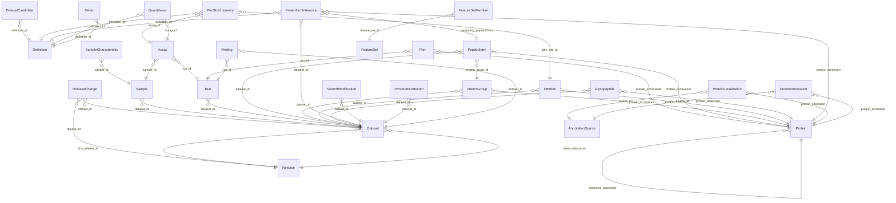

<!-- GENERATED by tools/build_docs.py from schema/datarepo.yaml. Do not edit by hand. -->

# dataRepo core schema (v0.0.6)

Generic core schema for an AI-ready repository of reanalyzed public proteomics datasets: datasets, samples, runs, PSMs, peptidoforms, protein groups, PTM sites and stoichiometry, glycopeptides, inferred proteoforms, long-format quantities, annotations, definitions, provenance and releases.

- **Schema id:** `https://w3id.org/datarepo/core`
- **Source:** `schema/datarepo.yaml`

## Tables

| Table | Grain / purpose |
|---|---|
| [Release](#release) | One immutable, citable release (D2). R2. |
| [ReleaseChange](#releasechange) | Changelog row: what changed for one dataset between releases (R2, question A7). |
| [DatasetCandidate](#datasetcandidate) | Discovery census row: every screened accession with its inclusion verdict (R1). Producer: the reanalysis project (aging). Answers "why is PXDn not here?". |
| [Dataset](#dataset) | One reanalyzed public dataset. |
| [Sample](#sample) | One biological sample, from the SDRF. Generic columns only. Study-specific columns (e.g. age) live in study-layer tables keyed on sample_id. |
| [SampleCharacteristic](#samplecharacteristic) | Every SDRF characteristic, kept verbatim, so nothing is lost to the curated columns. |
| [Run](#run) | One raw file. |
| [Assay](#assay) | One (run, channel) measurement of one sample. Label-free: one assay per run, channel "label_free". TMT: one per reporter channel. The unit every quantity attaches to (D5). |
| [Psm](#psm) | One peptide-spectrum match. |
| [Peptidoform](#peptidoform) | One peptidoform in one dataset (best evidence across runs). |
| [ProteinGroup](#proteingroup) | One protein group in one dataset. |
| [Protein](#protein) | One UniProt entry (isoforms are separate rows). |
| [PtmSite](#ptmsite) | One modified residue on one protein in one dataset, from PSM evidence. |
| [PtmStoichiometry](#ptmstoichiometry) | Modified fraction of one site in one sample group (R7). Producer: MetaMorpheus PTM stoichiometry (paper submitted); definition on the QuantProject register. Stored as produced. Corrected to aging 011's accepted shape in schema 0.0.5, while the table still held 0 rows (their 026). The corrections were accepted in dataRepo thread 012 and then missed by three releases, which is a dropped commitment rather than a decision -- and every one of them becomes expensive the moment a bundle carries a row, because each is a change to what an existing number MEANS rather than an addition beside it. |
| [Glycopeptide](#glycopeptide) | One glycopeptide identification (R16). Glycans are stored as COMPOSITIONS, never structures (trap J9). Quant goes in QuantValue with feature_type glycopeptide. |
| [ProteoformInference](#proteoforminference) | A proteoform INFERRED from bottom-up evidence (R7b; no top-down data). Sites on different peptides are not evidence of one molecule (trap J16): `sites_on_one_peptide` says whether any single peptide carries them all. |
| [QuantValue](#quantvalue) | One quantity of one feature in one assay. Long format (D5). Missing = no row or NA, never 0. |
| [AnnotationSource](#annotationsource) | A versioned annotation set from its owner (go's organelle map, UniProt, half-lives…). |
| [ProteinLocalization](#proteinlocalization) | Protein → compartment, as supplied by `go` (REQ-GO-2..10). Never computed here. |
| [ProteinAnnotation](#proteinannotation) | Any other per-protein fact from an owner (R6: half-life with tissue/organism, ELLP, genome of origin, complex membership; R5 orthologs). Key/value so new facts need no schema change. |
| [FeatureSet](#featureset) | A curated, versioned list of proteins or features (R8 reference panels). |
| [FeatureSetMember](#featuresetmember) | One member of a FeatureSet. |
| [Metric](#metric) | One producer-defined number about a dataset or run (PSM count at 1% FDR, ID rate, contaminant share…). Long, so two producers' versions of one number sit side by side with their definitions (S21) and new QC metrics need no schema change. |
| [SearchModification](#searchmodification) | One modification the search task DECLARED -- what the engine was configured to look for, not what it could have found and not what it placed (G28). The distinction is not pedantic: all three ingested datasets declare 33 UNIMOD accessions while their peptidoforms carry 16, 46 and 57, and `UNIMOD:45` and `UNIMOD:422` are PLACED in all three while appearing in no declaration at all -- found twice, independently, from the GPTMD-over-UniProt direction (dataRepo 021 section 6) and from the terminal-motif direction (aging 024 section 4). The table is honestly "what the search task declared", which is a useful thing to hold, PROVIDED nothing believes it is "what the search could have found". Both halves are named explicitly so the difference survives the naming (aging 024 section 6): this is the `_declared` table, and `search_modifications_placed` is the derived counterpart. A J8-style mass-silent check reads the PLACED one. |
| [Definition](#definition) | A metric definition, copied from its owning register (QuantProject DEF-*, etc.). |
| [ProvenanceRecord](#provenancerecord) | One pipeline stage for one dataset, flattened from provenance.json (original kept). |
| [Finding](#finding) | A flag on a dataset or run (low_id_rate, no_design_file, a SUSPICIOUS.md entry…). |

## How the tables connect

## Release

One immutable, citable release (D2). R2.

| Column | Type | Req | Meaning |
|---|---|---|---|
| `release_id` | `string` | key | Semantic version, e.g. 0.1.0. |
| `date` | `date` | yes | Date the release was frozen. |
| `doi` | `uriorcurie` |  | DOI minted for this release (Zenodo by default). |
| `schema_version` | `string` | yes | Version of this schema the release conforms to. |
| `qpx_version` | `string` | yes | QPX release this bundle is compatible with (D4). |
| `notes` | `string` |  | Free-text release notes. |

## ReleaseChange

Changelog row: what changed for one dataset between releases (R2, question A7).

| Column | Type | Req | Meaning |
|---|---|---|---|
| `release_id` | [Release](#release) | yes | Release this row belongs to. |
| `dataset_id` | [Dataset](#dataset) | yes | Dataset this row belongs to (ProteomeXchange accession). |
| `change_type` | [ChangeType](#changetype) | yes | Kind of change. |
| `reason` | `string` | yes | Why the dataset changed in this release. |

## DatasetCandidate

Discovery census row: every screened accession with its inclusion verdict (R1). Producer: the reanalysis project (aging). Answers "why is PXDn not here?".

| Column | Type | Req | Meaning |
|---|---|---|---|
| `census_version` | `string` | yes | Version of the discovery census this row belongs to. |
| `accession` | `string` | yes | Screened ProteomeXchange accession. (pattern `^(PXD|MSV|JPST|IPX)[0-9]+$`) |
| `included` | `boolean` | yes | True if the accession passed every gate and was reanalyzed. |
| `exclusion_reason` | `string` |  | Gate that excluded it (e.g. spectra gate: not HCD Orbitrap). |
| `definition_id` | [Definition](#definition) |  | Definition of the gate that decided inclusion. |

## Dataset

One reanalyzed public dataset.

QPX view: `dataset` (table-level; column mapping not yet verified).

| Column | Type | Req | Meaning |
|---|---|---|---|
| `dataset_id` | `string` | key | ProteomeXchange accession, e.g. PXD036557. (pattern `^(PXD|MSV|JPST|IPX)[0-9]+$`) |
| `title` | `string` |  | Title from the archive. |
| `organisms` | `uriorcurie` [ ] | yes | NCBITaxon IDs. |
| `acquisition` | [Acquisition](#acquisition) | yes | Acquisition mode. |
| `quant_method` | [QuantMethod](#quantmethod) | yes | Quantification principle. |
| `labelling` | [Labelling](#labelling) | yes | Label reagent, if any. |
| `labelling_plex` | `integer` |  | e.g. 16 for TMTpro 16-plex. |
| `enrichment` | [Enrichment](#enrichment) [ ] | yes | Enrichment steps before MS; [none] for whole proteome. |
| `instrument_vendor` | `string` |  | Instrument vendor, e.g. Thermo, Bruker, SCIEX. |
| `instruments` | `string` [ ] |  | PSI-MS instrument names or IDs. |
| `permitted_responses` | `string` [ ] |  | Which kinds of measurement this dataset MAY be used for -- an ALLOW-LIST, not a bar (aging 024 section 7). Empty means unrestricted. A deny-list fails open: a response type added later would be silently permitted on a dataset nobody re-examined, so a restriction is stated positively and a new response is excluded until someone says otherwise. The motivating case is PXD060431, whose low-resolution MS2 costs fragment mass accuracy and so bars it from `ptm_stoichiometry` and `ptm_site_localization` while leaving abundance sound (aging D24): `permitted_responses: [abundance]`. It is a real column rather than a `flags` string because a restriction a query cannot honour without parsing prose is not a restriction. The vocabulary is the producing instance's, not an enum here -- the core knows nothing about any one study (U5), and a study layer's own response values must be a subset of what this permits. |
| `axis_source` | [AxisSource](#axissource) | yes | Where the six axes above came from. |
| `submission_type` | `string` |  | Archive submission type (COMPLETE, PARTIAL). |
| `search_engine` | `string` | yes | Search engine used for the reanalysis. |
| `search_engine_version` | `string` | yes | Exact search-engine version. |
| `search_database` | `string` |  | Protein database name and release, e.g. UniProt human reviewed 2026_03 + isoforms (G10). |
| `search_database_sha256` | `string` |  | SHA-256 of the protein database file searched. |
| `sdrf_status` | [SdrfStatus](#sdrfstatus) |  | Whether the SDRF was trusted, repaired or replaced. |
| `pipeline_repo` | `string` |  | Repository of the pipeline that produced it. |
| `pipeline_commit` | `string` |  | Git commit of the pipeline that produced it. |
| `searches` | `string` [ ] |  | Search kinds run on this dataset: standard, gptmd, glyco_N, glyco_O, glyco_NO. |
| `first_release_id` | [Release](#release) |  | Release in which the dataset first appeared. |
| `latest_release_id` | [Release](#release) |  | Most recent release that changed the dataset. |

## Sample

One biological sample, from the SDRF. Generic columns only. Study-specific columns (e.g. age) live in study-layer tables keyed on sample_id.

QPX view: `sample` (table-level; column mapping not yet verified).

| Column | Type | Req | Meaning |
|---|---|---|---|
| `sample_id` | `string` | key | <dataset_id>:<SDRF source name> |
| `dataset_id` | [Dataset](#dataset) | yes | Dataset this row belongs to (ProteomeXchange accession). |
| `source_name` | `string` | yes | SDRF source name. Also the donor key for longitudinal designs (R10). |
| `organism` | `uriorcurie` | yes | NCBITaxon term of the sample's organism. |
| `sex` | `uriorcurie` |  | PATO term. |
| `organism_part` | `uriorcurie` |  | UBERON term. |
| `cell_type` | `uriorcurie` |  | CL term. |
| `disease` | `uriorcurie` |  | MONDO or EFO term; PATO:0000461 for normal. |
| `condition` | `string` |  | Free-text condition, e.g. HGPS, caloric restriction (B7, I4). |
| `material_type` | `string` |  | SDRF material type: tissue, cell culture, body fluid… (B8). |
| `cell_line` | `string` |  | Cell line name, for cell-culture samples. |
| `individual_id` | `string` |  | SDRF characteristics[individual]. Same donor across samples = longitudinal (B11, R10). |
| `biological_replicate` | `integer` |  | Biological replicate number from the SDRF. |
| `timepoint` | `string` |  | Longitudinal timepoint label if the SDRF has one (R10). |

## SampleCharacteristic

Every SDRF characteristic, kept verbatim, so nothing is lost to the curated columns.

| Column | Type | Req | Meaning |
|---|---|---|---|
| `sample_id` | [Sample](#sample) | yes | Sample this row describes. |
| `name` | `string` | yes | SDRF column, e.g. characteristics[age]. |
| `value` | `string` | yes | Value as written in the SDRF. |
| `term` | `uriorcurie` |  | Ontology term for the value, where the SDRF gives one. |

## Run

One raw file.

QPX view: `run` (table-level; column mapping not yet verified).

| Column | Type | Req | Meaning |
|---|---|---|---|
| `run_id` | `string` | key | <dataset_id>:<file name without extension> |
| `dataset_id` | [Dataset](#dataset) | yes | Dataset this row belongs to (ProteomeXchange accession). |
| `file_name` | `string` | yes | Raw file name as deposited. |
| `sha256` | `string` |  | SHA-256 of the file that was searched. |
| `pride_checksum_sha1` | `string` |  | Checksum published by the archive, for comparison with sha256 (F6). |
| `fraction` | `integer` |  | Fraction identifier from the SDRF. |
| `technical_replicate` | `integer` |  | Technical replicate number. |
| `fragmentation` | `string` [ ] |  | HCD, EThcD, ETD… (T10). |
| `ms2_spectra` | `integer` |  | Number of MS2 spectra in the file. |
| `run_minutes` | `float` |  | Acquisition length in minutes. |
| `qc_pass` | `boolean` |  | Whether the run passed the producer's spectra QC gate. |
| `instrument_model` | `string` |  | Instrument model from the raw file header. |
| `acquisition_datetime` | `datetime` |  | From the raw file header (J14 batch/date checks, H4). |

## Assay

One (run, channel) measurement of one sample. Label-free: one assay per run, channel "label_free". TMT: one per reporter channel. The unit every quantity attaches to (D5).

| Column | Type | Req | Meaning |
|---|---|---|---|
| `assay_id` | `string` | key | <run_id>:<channel> |
| `run_id` | [Run](#run) | yes | Raw file this row belongs to. |
| `channel` | `string` | yes | label_free, or the reporter / label channel (e.g. TMT126). |
| `sample_id` | [Sample](#sample) | yes | Sample measured in this assay. |

## Psm

One peptide-spectrum match.

QPX view: `psm` (table-level; column mapping not yet verified).

| Column | Type | Req | Meaning |
|---|---|---|---|
| `psm_id` | `string` | key | <run_id>:<scan>:<rank> |
| `run_id` | [Run](#run) | yes | Raw file this row belongs to. |
| `scan` | `integer` | yes | Scan number of the MS2 spectrum. |
| `usi` | `string` | yes | mzspec:<PXD>:<file>:scan:<n>:<ProForma>/<z>. Resolvable via PRIDE PROXI. |
| `peptidoform` | `string` | yes | ProForma 2 string with UNIMOD accessions. |
| `base_sequence` | `string` | yes | Unmodified amino-acid sequence. |
| `precursor_charge` | `integer` | yes | Precursor charge state. |
| `precursor_mz` | `float` |  | Observed precursor m/z. |
| `retention_time_min` | `float` |  | Retention time of the MS2 scan in minutes. |
| `score` | `float` |  | Search-engine score. |
| `delta_score` | `float` |  | Score difference to the next-best candidate. |
| `q_value` | `float` | yes | False discovery rate q-value (0-1). (range 0..1) |
| `q_value_notch` | `float` |  | q-value within the match's notch (mass-offset bin). Producers that accept a match on both q-values report counts that cannot be reproduced from q_value alone. (range 0..1) |
| `notch` | `string` |  | The producer's notch assignment, verbatim. A search that leaves it unresolved reports several candidates separated by '\|', and that text is the evidence for notch_ambiguous. |
| `notch_ambiguous` | `boolean` |  | The notch never resolved to one value. Producers exclude these from their headline identification count even though both q-values pass, so a count taken without this column cannot be reproduced (aging DEF-PSM-1PCT v1). |
| `pep` | `float` |  | Posterior error probability (0-1). (range 0..1) |
| `pep_q_value` | `float` |  | q-value computed from PEP. (range 0..1) |
| `mass_error_ppm` | `float` |  | Precursor mass error in ppm. |
| `target_decoy` | [TargetDecoy](#targetdecoy) | yes | Target, decoy or contaminant. |
| `protein_accessions` | [Protein](#protein) [ ] |  | All protein accessions the peptide maps to. |
| `ambiguity_level` | `string` |  | Producer's ambiguity level (e.g. MetaMorpheus 1-5), including I/L. |
| `localization_score` | `float` |  | Producer's modification-localization score. |
| `search` | `string` |  | Which search produced it (standard, gptmd, glyco_*). |
| `missed_cleavages` | `integer` |  | Number of missed protease cleavages. |
| `nonspecific_termini` | `integer` |  | Termini not matching the protease (L3 truncation). (range 0..2) |
| `start_residue` | `integer` |  | First residue of the peptide in the protein (1-based). |
| `end_residue` | `integer` |  | Last residue of the peptide in the protein (1-based). |
| `matched_ion_series` | `string` |  | Producer's annotated fragment list, verbatim (F7; full evidence is R14). |
| `matched_ion_count` | `integer` |  | Number of matched fragment ions. |

## Peptidoform

One peptidoform in one dataset (best evidence across runs).

QPX view: `feature` (table-level; column mapping not yet verified).

| Column | Type | Req | Meaning |
|---|---|---|---|
| `peptidoform_id` | `string` | key | <dataset_id>:<ProForma> |
| `dataset_id` | [Dataset](#dataset) | yes | Dataset this row belongs to (ProteomeXchange accession). |
| `peptidoform` | `string` | yes | ProForma 2 string with UNIMOD accessions. |
| `base_sequence` | `string` | yes | Unmodified amino-acid sequence. |
| `best_q_value` | `float` |  | Lowest q-value among the supporting PSMs. (range 0..1) |
| `best_q_value_notch` | `float` |  | Lowest notch q-value among the supporting PSMs. (range 0..1) |
| `best_pep` | `float` |  | Lowest PEP among the supporting PSMs. (range 0..1) |
| `target_decoy` | [TargetDecoy](#targetdecoy) | yes | Target, decoy or contaminant. Decoy peptidoforms are kept so a caller can recompute FDR. |
| `n_psms` | `integer` |  | Number of PSMs supporting this row. |
| `protein_group_id` | [ProteinGroup](#proteingroup) |  | Protein group the peptidoform was assigned to. |
| `protein_accessions` | [Protein](#protein) [ ] |  | All protein accessions the peptide maps to. |
| `is_unique` | `boolean` |  | Maps to exactly one protein (R11, mzLib REQ-MZLIB-1). |
| `is_isoform_specific` | `boolean` |  | Distinguishes one isoform (O-section questions). |

## ProteinGroup

One protein group in one dataset.

QPX view: `pg` (table-level; column mapping not yet verified).

| Column | Type | Req | Meaning |
|---|---|---|---|
| `protein_group_id` | `string` | key | <dataset_id>:<sorted accessions joined by ;> |
| `dataset_id` | [Dataset](#dataset) | yes | Dataset this row belongs to (ProteomeXchange accession). |
| `protein_accessions` | [Protein](#protein) [ ] | yes | All protein accessions the peptide maps to. |
| `genes` | `string` [ ] |  | Gene names of the member proteins. |
| `target_decoy` | [TargetDecoy](#targetdecoy) |  | Target, decoy or contaminant, as the producer classified the group. |
| `q_value` | `float` |  | Protein-group q-value. (range 0..1) |
| `sequence_coverage` | `float` |  | Fraction of the sequence covered (0-1). (range 0..1) |
| `unique_peptides` | `integer` |  | Number of peptides unique to this group. |
| `shared_peptides` | `integer` |  | Number of peptides shared with other groups. |

## Protein

One UniProt entry (isoforms are separate rows).

| Column | Type | Req | Meaning |
|---|---|---|---|
| `protein_accession` | `string` | key | UniProt accession (isoform suffix kept) or custom-database ID. |
| `canonical_accession` | [Protein](#protein) |  | Self for canonical entries. |
| `gene` | `string` |  | Primary gene name. |
| `organism` | `uriorcurie` | yes | NCBITaxon term. |
| `length` | `integer` |  | Sequence length in residues. |
| `source_db` | `string` | yes | uniprot, or the custom database that supplied it (e.g. progerin, D8). |
| `uniprot_release` | `string` |  | UniProt release the entry was taken from. |
| `is_contaminant` | `boolean` |  | True if the entry comes from the contaminant database. |

## PtmSite

One modified residue on one protein in one dataset, from PSM evidence.

| Column | Type | Req | Meaning |
|---|---|---|---|
| `ptm_site_id` | `string` | key | <dataset_id>:<accession>:<residue><position>:<modification_name>, with '@<site_type>' appended ONLY when site_type is not 'residue' -- so no id written before schema 0.0.5 moves (aging 024 section 4). A terminal site is keyed on the position of the residue it sits on, never on a sentinel position: a protein N-terminal acetylation and an N6-acetyllysine on residue 1 are different chemistries at the same coordinate, and a key that cannot separate them will eventually merge them.  The last component is the SEARCH ENGINE'S OWN NAME for the modification (MetaMorpheus's IdWithMotif, e.g. 'Carbamidomethyl on C'), never the UNIMOD accession. Keying on UNIMOD cost sites: a modification with no UNIMOD cross-reference cannot form such a key at all, so its sites were not written as nulls -- they were not written, and a query for them returned an empty answer indistinguishable from 'never identified' (aging 019 section 3; Hydroxybutyrylation on K, 43 PSMs and 10 peptidoforms in PXD027318, 0 sites). It is not a rare shape: mzLib 1.0.591 carries a Unimod cross-reference on 86.8% of Mods.txt and 33.6% of ptmlist.txt, so a GPTMD run over UniProt annotations meets unmapped names routinely. The name is always present, which is the whole argument, and QuantProject has ruled that the native identity of a site is (database version, accession, position, IdWithMotif) with Unimod a DERIVED VIEW over it -- a derived view cannot be the key, because it cannot represent everything the engine finds. The id is also then invariant under a mapping improvement: when mzLib later gives Hydroxybutyrylation an accession, `modification` fills in and no id moves. Nothing is lost cross-dataset, because dataset_id is the first component and so this key never joins across datasets anyway: that is what the `modification` and `modification_name` COLUMNS are for. The residue is load-bearing and must not be dropped to 'simplify' the key: one UNIMOD accession covers several chemistries on different residues (UNIMOD:7 is deamidation on N and on Q and citrullination on R; UNIMOD:35 is hydroxylation on K/N/P and oxidation on M), so a key without it merges them. |
| `dataset_id` | [Dataset](#dataset) | yes | Dataset this row belongs to (ProteomeXchange accession). |
| `protein_accession` | [Protein](#protein) | yes | UniProt (or custom-database) accession, isoform suffix kept. |
| `position` | `integer` | yes | Residue position in the protein (1-based). |
| `residue` | `string` |  | Modified amino acid (one-letter code) -- for a terminal site, the residue the modification actually sits ON, not the string 'N-term'. A terminus is a position, and the thing modified there is still a residue; `site_type` carries the fact that it is terminal. Nullable because a producer can place a modification at a terminus without naming the residue, and a null is then honest where a guess would not be. |
| `site_type` | [SiteType](#sitetype) | yes | Where on the molecule the modification sits. Defaults to `residue`, which is what almost every row is; the terminal values exist because 1,367 terminal sites at q<=0.01 across three datasets were not written at all before schema 0.0.5 -- the ingester skipped every modification at a peptide terminus, so `ptm_sites` held 0 rows for them while `peptidoforms` held all 3,085 (aging 024 section 4). N-terminal acetylation is co-translational, among the most abundant marks in any proteome, and governs the N-degron pathway and so protein turnover: it is not a tail chemistry in an aging repository. A reader querying `ptm_sites` for acetylation before this got a lysine-only answer with nothing saying so. |
| `modification` | `uriorcurie` |  | UNIMOD accession, ABSENT when the search engine's modification has no UNIMOD cross-reference. A null here means 'this chemistry has no Unimod term in the registry that searched it', never 'unmodified' and never 'unknown chemistry': `modification_name` always says what it is. A caller aggregating by UNIMOD must decide what to do with these rows rather than have them silently dropped, which is what keying on UNIMOD used to do for them. |
| `modification_name` | `string` | yes | The search engine's own name for the modification, verbatim (MetaMorpheus's IdWithMotif, e.g. 'Hydroxybutyrylation on K'). Always present, and the component of ptm_site_id that makes the key always formable. It is engine-specific by construction, which is safe here because a dataset is searched by one engine and dataset_id is part of the key; cross-dataset work goes through `modification`, or through this column when both datasets share an engine. |
| `target_decoy` | [TargetDecoy](#targetdecoy) |  | Target or contaminant, from the supporting PSMs. Contaminant sites are kept because they are real measurements of real molecules and are used as a process control, but they are not the sample, so a caller filters on this rather than having the decision made for them. |
| `best_ambiguity_level` | `string` |  | Lowest producer ambiguity level among the PSMs that placed this site (1 < 2A < 2B < 2C < 2D < 3 < 4 < 5). Sites are emitted at any level, because the producer's occupancy population applies no level filter. `best_ambiguity_level = '1' AND target_decoy = 'target'` selects exactly the site set a level-1, target-only derivation produces -- but n_psms and best_q_value on those rows count all the evidence, so they are not the same numbers that derivation would report. |
| `localization_score` | `float` |  | Producer's modification-localization score. Null for an ordinary GPTMD hit, which MetaMorpheus does not localize -- absence here means the producer computed none, not that the site is unlocalized, and a caller asking whether a site is confidently localized should be refused rather than given an empty cell. |
| `n_psms` | `integer` |  | Accepted PSMs that placed this site, at any ambiguity level and including contaminant PSMs. This is evidence depth for the site, and it is the measure the producer's occupancy denominator is built from, so it deliberately counts more broadly than a level-1 target-only view would. |
| `best_q_value` | `float` |  | Lowest q-value among the supporting PSMs. (range 0..1) |

## PtmStoichiometry

Modified fraction of one site in one sample group (R7). Producer: MetaMorpheus PTM stoichiometry (paper submitted); definition on the QuantProject register. Stored as produced. Corrected to aging 011's accepted shape in schema 0.0.5, while the table still held 0 rows (their 026). The corrections were accepted in dataRepo thread 012 and then missed by three releases, which is a dropped commitment rather than a decision -- and every one of them becomes expensive the moment a bundle carries a row, because each is a change to what an existing number MEANS rather than an addition beside it.

| Column | Type | Req | Meaning |
|---|---|---|---|
| `ptm_site_id` | [PtmSite](#ptmsite) | yes | Site whose modified fraction this is. Keyed on the search engine's own modification name since 0.5.0, not on a UNIMOD accession. |
| `assay_id` | [Assay](#assay) | yes | The SAMPLE GROUP the occupancy was computed over, not a single run x channel. MetaMorpheus's occupancy is a group-level quantity: it pools the covering PSMs of every run in the group, so attributing it to one run would state a measurement that was never made. Named `assay_id` because it points into `Assay`, which carries the grouping. |
| `modified_fraction_count` | `float` |  | Modified fraction from PSM COUNTS (`DEF-OCC-PSMS`): n_modified_psms / n_covering_psms. Kept in its own column, never merged with the intensity estimate. The two disagree about THREEFOLD overall and sevenfold at sites with 21-50 PSMs, so a single column would force a producer to pick one and throw the other away silently, with nothing in the row saying which. Two columns is the shape that cannot be averaged by accident; a `definition_id` discriminator is not, because it would mean two rows per (site, group) differing only in a string, which a natural key then has to treat as a duplicate. (range 0..1) |
| `modified_fraction_intensity` | `float` |  | Modified fraction from INTENSITIES. See `modified_fraction_count` for why these are two columns and not one, and `intensity_is_floor` for why a 0.0 here is not self-explanatory. (range 0..1) |
| `intensity_is_floor` | `boolean` |  | True when `modified_fraction_intensity` is a FLOOR rather than a measurement -- `DEF-OCC-INT-ZERO`: a fraction of 0.0000 whose numerator is a literal zero means the modified form was not detected, not that it was measured at zero. Without this flag both land as 0.0 and the difference is unrecoverable, which is the same absence-reading-as-a-measurement failure the `findings` mechanism exists to prevent. Null when there is no intensity estimate to qualify. |
| `n_modified_psms` | `integer` |  | PSMs supporting the modified form, as `DEF-OCC-PSMS` counts them. |
| `n_covering_psms` | `integer` |  | COVERING PSMs: the definition's denominator. An ambiguous PSM counts in the denominator of every position it covers, so this is a different population AND a different unit from a peptidoform count -- there is no arithmetic that converts one into the other, which is why the old `n_unmodified_peptidoforms` could only ever have been guessed at. Nullable, because a producer reporting only an intensity estimate has no PSM counts to give. |
| `definition_id` | [Definition](#definition) | yes | Owner's definition ID giving this number its meaning. |

## Glycopeptide

One glycopeptide identification (R16). Glycans are stored as COMPOSITIONS, never structures (trap J9). Quant goes in QuantValue with feature_type glycopeptide.

| Column | Type | Req | Meaning |
|---|---|---|---|
| `glycopeptide_id` | `string` | key | Stable ID: dataset, peptidoform and composition. |
| `dataset_id` | [Dataset](#dataset) | yes | Dataset this row belongs to (ProteomeXchange accession). |
| `peptidoform` | `string` | yes | ProForma 2 string with UNIMOD accessions. |
| `protein_accession` | [Protein](#protein) | yes | UniProt (or custom-database) accession, isoform suffix kept. |
| `glycosite_positions` | `integer` [ ] |  | Glycosylated residue positions in the protein (1-based). |
| `glycan_type` | [GlycanType](#glycantype) | yes | N-linked, O-linked or both on one peptide. |
| `glycan_composition` | `string` | yes | e.g. HexNAc(4)Hex(5)NeuAc(2). |
| `localization_level` | [GlycoLocalizationLevel](#glycolocalizationlevel) |  | How confidently the glycan is placed on its residue. |
| `q_value` | `float` |  | False discovery rate q-value (0-1). (range 0..1) |
| `n_psms` | `integer` |  | Number of PSMs supporting this row. |

## ProteoformInference

A proteoform INFERRED from bottom-up evidence (R7b; no top-down data). Sites on different peptides are not evidence of one molecule (trap J16): `sites_on_one_peptide` says whether any single peptide carries them all.

| Column | Type | Req | Meaning |
|---|---|---|---|
| `proteoform_id` | `string` | key | Stable ID of the inferred proteoform. |
| `dataset_id` | [Dataset](#dataset) | yes | Dataset this row belongs to (ProteomeXchange accession). |
| `protein_accession` | [Protein](#protein) | yes | UniProt (or custom-database) accession, isoform suffix kept. |
| `proforma` | `string` | yes | Full-protein ProForma of the inferred form. |
| `supporting_peptidoforms` | [Peptidoform](#peptidoform) [ ] | yes | Peptidoforms the inference rests on. |
| `sites_on_one_peptide` | `boolean` | yes | True only if a single peptidoform carries every site (trap J16). |
| `inference_confidence` | `float` | yes | Producer's confidence in the inference (0-1). (range 0..1) |
| `definition_id` | [Definition](#definition) | yes | Owner's definition ID giving this number its meaning. |

## QuantValue

One quantity of one feature in one assay. Long format (D5). Missing = no row or NA, never 0.

QPX view: `feature` (table-level; column mapping not yet verified).

| Column | Type | Req | Meaning |
|---|---|---|---|
| `assay_id` | [Assay](#assay) | yes | Assay (run x channel) this value was measured in. |
| `feature_type` | [FeatureType](#featuretype) | yes | Which table feature_id points into. |
| `feature_id` | `string` | yes | ID in the table named by feature_type. |
| `value` | `float` |  | The quantity (e.g. apex intensity); absent row or NA when not measured, never 0. |
| `detection_type` | [DetectionType](#detectiontype) |  | How the value was obtained: MS/MS or match-between-runs. |
| `pip_q_value` | `float` |  | FlashLFQ MBR peak q (PIP Q-Value). (range 0..1) |
| `mbr_kept` | `boolean` |  | Passes the producer's MBR filter (QuantProject DEF-MBR-KEPT). |
| `definition_id` | [Definition](#definition) | yes | e.g. apex intensity (aging D13). |

## AnnotationSource

A versioned annotation set from its owner (go's organelle map, UniProt, half-lives…).

| Column | Type | Req | Meaning |
|---|---|---|---|
| `source_id` | `string` | key | Stable ID of the annotation set, e.g. go-organelle-map-v3. |
| `owner_project` | `string` | yes | Project that owns and maintains the content. |
| `version` | `string` | yes | Owner's version string. |
| `doi` | `uriorcurie` |  | DOI, if one has been minted. |

## ProteinLocalization

Protein → compartment, as supplied by `go` (REQ-GO-2..10). Never computed here.

| Column | Type | Req | Meaning |
|---|---|---|---|
| `protein_accession` | [Protein](#protein) | yes | UniProt (or custom-database) accession, isoform suffix kept. |
| `compartment` | `uriorcurie` | yes | GO-CC term. |
| `organelle_label` | `string` | yes | Readable organelle name from the owner's map. |
| `evidence` | `string` |  | Evidence code or note from the source. |
| `source_id` | [AnnotationSource](#annotationsource) | yes | Annotation source (owner + version) this row comes from. |

## ProteinAnnotation

Any other per-protein fact from an owner (R6: half-life with tissue/organism, ELLP, genome of origin, complex membership; R5 orthologs). Key/value so new facts need no schema change.

| Column | Type | Req | Meaning |
|---|---|---|---|
| `protein_accession` | [Protein](#protein) | yes | UniProt (or custom-database) accession, isoform suffix kept. |
| `key` | `string` | yes | Fact name, e.g. half_life_days, ellp, genome_of_origin, complex, ortholog. |
| `value` | `string` | yes | Fact value, as the owner gives it. |
| `position` | `integer` |  | Set for residue-level facts, e.g. predicted deamidation rate (L2). |
| `qualifier` | `string` |  | e.g. tissue or organism a half-life was measured in. |
| `source_id` | [AnnotationSource](#annotationsource) | yes | Annotation source (owner + version) this row comes from. |

## FeatureSet

A curated, versioned list of proteins or features (R8 reference panels).

| Column | Type | Req | Meaning |
|---|---|---|---|
| `feature_set_id` | `string` | key | Stable ID of the set, e.g. protage-204-v1. |
| `name` | `string` | yes | Human-readable name. |
| `version` | `string` | yes | Owner's version string. |
| `owner_project` | `string` | yes | Project that owns and maintains the content. |
| `doi` | `uriorcurie` |  | DOI, if one has been minted. |
| `description` | `string` |  | What the set is and where it comes from. |

## FeatureSetMember

One member of a FeatureSet.

| Column | Type | Req | Meaning |
|---|---|---|---|
| `feature_set_id` | [FeatureSet](#featureset) | yes | Set this member belongs to. |
| `feature_type` | [FeatureType](#featuretype) | yes | Which table feature_id points into. |
| `feature_id` | `string` | yes | Identifier of the feature in the table named by feature_type. |
| `role` | `string` |  | e.g. weight or direction, as the owner defines it. |

## Metric

One producer-defined number about a dataset or run (PSM count at 1% FDR, ID rate, contaminant share…). Long, so two producers' versions of one number sit side by side with their definitions (S21) and new QC metrics need no schema change.

| Column | Type | Req | Meaning |
|---|---|---|---|
| `scope` | [MetricScope](#metricscope) | yes | Whether the metric is about a dataset or a run. |
| `scope_id` | `string` | yes | dataset_id or run_id. |
| `name` | `string` | yes | Metric name, e.g. psms_1pct, id_rate, contaminant_share. |
| `value` | `float` |  | Metric value; NA if not computed. |
| `definition_id` | [Definition](#definition) | yes | Owner's definition ID giving this number its meaning. |
| `source` | `string` | yes | File the number came from, e.g. provenance.json id_rate, results.txt. |

## SearchModification

One modification the search task DECLARED -- what the engine was configured to look for, not what it could have found and not what it placed (G28). The distinction is not pedantic: all three ingested datasets declare 33 UNIMOD accessions while their peptidoforms carry 16, 46 and 57, and `UNIMOD:45` and `UNIMOD:422` are PLACED in all three while appearing in no declaration at all -- found twice, independently, from the GPTMD-over-UniProt direction (dataRepo 021 section 6) and from the terminal-motif direction (aging 024 section 4). The table is honestly "what the search task declared", which is a useful thing to hold, PROVIDED nothing believes it is "what the search could have found". Both halves are named explicitly so the difference survives the naming (aging 024 section 6): this is the `_declared` table, and `search_modifications_placed` is the derived counterpart. A J8-style mass-silent check reads the PLACED one.

| Column | Type | Req | Meaning |
|---|---|---|---|
| `dataset_id` | [Dataset](#dataset) | yes | Dataset this row belongs to (ProteomeXchange accession). |
| `modification` | `uriorcurie` |  | UNIMOD accession, absent for a modification that has none (metal adducts, engine-specific entries). `name` always identifies it. |
| `name` | `string` | yes | Modification name as the search engine lists it. |
| `residues` | `string` | yes | Residues or termini it was allowed on. |
| `usage` | [ModUsage](#modusage) | yes | Fixed, variable, GPTMD candidate or glycan. |

## Definition

A metric definition, copied from its owning register (QuantProject DEF-*, etc.).

| Column | Type | Req | Meaning |
|---|---|---|---|
| `definition_id` | `string` | key | The owner's ID, e.g. DEF-QC-MBR. |
| `version` | `string` | yes | Owner's version string. |
| `owner_project` | `string` | yes | Project that owns and maintains the content. |
| `text` | `string` | yes | Full definition text, copied from the owner's register. |
| `url` | `uriorcurie` |  | Link to the definition in the owner's register. |

## ProvenanceRecord

One pipeline stage for one dataset, flattened from provenance.json (original kept).

| Column | Type | Req | Meaning |
|---|---|---|---|
| `dataset_id` | [Dataset](#dataset) | yes | Dataset this row belongs to (ProteomeXchange accession). |
| `stage` | `string` | yes | Pipeline stage name, e.g. search, fetch, qc. |
| `provenance_schema` | `string` | yes | e.g. aging-provenance/2. |
| `started_utc` | `datetime` |  | Stage start time (UTC). |
| `finished_utc` | `datetime` |  | Stage end time (UTC). |
| `pipeline_repo` | `string` |  | Repository of the pipeline that produced it. |
| `pipeline_commit` | `string` |  | Git commit of the pipeline that produced it. |
| `params_sha256` | `string` |  | SHA-256 of the parameter file. |
| `tools_json` | `string` |  | The tools block, verbatim JSON. |
| `params_json` | `string` |  | The params block, verbatim JSON. |
| `wall_seconds` | `float` |  | Wall-clock time of the stage. |
| `peak_rss_gib` | `float` |  | Peak memory of the stage in GiB. |
| `resources_json` | `string` |  | The resources block, verbatim JSON (G9). |
| `original_path` | `string` | yes | Path of the stored provenance.json in the bundle. |
| `original_sha256` | `string` | yes | SHA-256 of the stored provenance.json. |

## Finding

A flag on a dataset or run (low_id_rate, no_design_file, a SUSPICIOUS.md entry…).

| Column | Type | Req | Meaning |
|---|---|---|---|
| `finding_id` | `string` | key | Stable ID of the finding. |
| `dataset_id` | [Dataset](#dataset) | yes | Dataset this row belongs to (ProteomeXchange accession). |
| `run_id` | [Run](#run) |  | Run the finding is about, if it is run-specific. |
| `code` | `string` | yes | Machine-readable flag, e.g. low_id_rate, no_design_file. |
| `severity` | [Severity](#severity) | yes | How much it should change trust in the data. |
| `status` | [FindingStatus](#findingstatus) | yes | Whether it is still open. |
| `message` | `string` | yes | Plain-language explanation for people and agents. |
| `source` | `string` | yes | provenance flags, SUSPICIOUS.md S<n>, … |

## Controlled vocabularies

### Acquisition

MS acquisition mode.

| Value | Meaning |
|---|---|
| `DDA` |  |
| `DIA` |  |
| `PRM` |  |
| `mixed` |  |

### QuantMethod

How abundance is read out. The reagent detail goes in `labelling`.

| Value | Meaning |
|---|---|
| `label_free` |  |
| `isobaric` | TMT, iTRAQ. |
| `metabolic` | SILAC, 15N, NeuCode. |
| `none` | Identification only. |

### Labelling

Label reagent (aging 003 axis). `TMT` carries its plex in Dataset.labelling_plex.

| Value | Meaning |
|---|---|
| `none` |  |
| `SILAC` |  |
| `pulse_SILAC` |  |
| `N15` |  |
| `NeuCode` |  |
| `TMT` |  |
| `iTRAQ` |  |

### Enrichment

Enrichment before MS (aging 003 axis). A dataset can have several.

| Value | Meaning |
|---|---|
| `none` |  |
| `phospho` |  |
| `acetyl` |  |
| `ubiquitin_GG` |  |
| `succinyl` |  |
| `glyco` |  |
| `other` |  |

### SdrfStatus

How far the dataset's SDRF could be trusted (P4).

| Value | Meaning |
|---|---|
| `trusted` |  |
| `repaired` |  |
| `config_fallback` | No usable SDRF; design came from the pipeline's config. |
| `absent` |  |

### ModUsage

How a modification entered the search (P1).

| Value | Meaning |
|---|---|
| `fixed` |  |
| `variable` |  |
| `gptmd` | Candidate list for GPTMD discovery. |
| `glycan` |  |

### MetricScope

What a Metric row is about.

| Value | Meaning |
|---|---|
| `dataset` |  |
| `run` |  |

### AxisSource

Where a dataset-axis value came from, until aging's provenance carries it (DATAREPO-2).

| Value | Meaning |
|---|---|
| `provenance` | Written explicitly by the producing pipeline. The target state. |
| `sdrf` |  |
| `discover` | Inferred from PRIDE metadata at discovery. |
| `curated` |  |

### SiteType

Where on the molecule a modification sits. Ruled by aging 024 section 4, which is the same ruling they gave QuantProject in their 020, so it costs no new concept. A `site_type` rather than a positional convention (position = 0 for a terminus, say) because a protein N-terminal acetylation and an N6-acetyllysine on residue 1 are DIFFERENT CHEMISTRIES AT THE SAME COORDINATE, and a key that cannot separate them will eventually merge them.

| Value | Meaning |
|---|---|
| `residue` | An internal residue. The default, and what almost every row is. |
| `protein_n_term` | The protein's own N-terminus. Includes the case where the initiator methionine was cleaved and the modification sits on residue 2 -- which is the COMMON case, not an edge case: co-translational N-terminal acetylation follows Met excision, so a rule of "peptide starts at residue 1" would mislabel the most abundant terminal chemistry in the proteome as peptide_n_term. dataRepo derives this from the producer's own `previous_residue` and peptide description rather than from the position alone. |
| `protein_c_term` | The protein's own C-terminus. |
| `peptide_n_term` | The N-terminus of this peptide, which is an internal position in the protein -- a cleavage artefact position, not a protein terminus. Ammonia loss on a peptide's first residue is the common case. |
| `peptide_c_term` | The C-terminus of this peptide, internal to the protein. |

### TargetDecoy

Target/decoy/contaminant status of a match.

| Value | Meaning |
|---|---|
| `target` |  |
| `decoy` |  |
| `contaminant` |  |

### DetectionType

How a quantity was obtained.

| Value | Meaning |
|---|---|
| `MSMS` |  |
| `MBR` |  |
| `imputed` | Never produced by dataRepo; allowed only if a producer writes it and marks it. |
| `not_detected` |  |

### FeatureType

What a QuantValue or effect row is about.

| Value | Meaning |
|---|---|
| `peptidoform` |  |
| `protein_group` |  |
| `ptm_site` |  |
| `glycopeptide` |  |
| `proteoform` |  |
| `protein` |  |

### GlycanType

Glycan linkage class.

| Value | Meaning |
|---|---|
| `N` |  |
| `O` |  |
| `N_and_O` | One peptide carrying both (combined N+O search). |

### GlycoLocalizationLevel

MetaMorpheus O-Pair style levels; confirm names with the producer (R16).

| Value | Meaning |
|---|---|
| `level_1` |  |
| `level_1b` |  |
| `level_2` |  |
| `level_3` |  |

### Severity

How much a Finding should change trust.

| Value | Meaning |
|---|---|
| `info` |  |
| `warning` |  |
| `error` |  |

### FindingStatus

Lifecycle of a Finding.

| Value | Meaning |
|---|---|
| `open` |  |
| `resolved` |  |
| `wont_fix` |  |

### ChangeType

Kind of change recorded in a ReleaseChange.

| Value | Meaning |
|---|---|
| `added` |  |
| `removed` |  |
| `reprocessed` |  |
| `annotation_updated` |  |
| `schema_changed` |  |
