<!-- GENERATED by tools/build_docs.py from schema/datarepo.yaml. Do not edit by hand. -->

# dataRepo core schema (v0.0.13)

Generic core schema for an AI-ready repository of reanalyzed public proteomics datasets: datasets, samples, runs, PSMs, peptidoforms, protein groups, PTM sites and stoichiometry, glycopeptides, inferred proteoforms, long-format quantities, annotations, definitions, provenance and releases.

- **Schema id:** `https://w3id.org/datarepo/core`
- **Source:** `schema/datarepo.yaml`

## Tables

| Table | Grain / purpose |
|---|---|
| [Release](#release) | One immutable, citable release (D2). R2. |
| [ReleaseChange](#releasechange) | Changelog row: what changed for one dataset between releases (R2, question A7). |
| [DatasetCandidate](#datasetcandidate) | Discovery census row: every screened accession with its inclusion verdict (R1). Producer: the reanalysis project (aging). Answers "why is PXDn not here?". |
| [Dataset](#dataset) | One reanalyzed public dataset. |
| [Sample](#sample) | One biological sample, from the SDRF. Generic columns only. Study-specific columns (e.g. age) live in study-layer tables keyed on sample_id. |
| [SampleCharacteristic](#samplecharacteristic) | Every SDRF characteristic, kept verbatim, so nothing is lost to the curated columns. |
| [Run](#run) | One raw file. |
| [Assay](#assay) | One (run, channel) measurement of one sample. Label-free: one assay per run, channel "label_free". TMT: one per reporter channel. The unit every quantity attaches to (D5). |
| [Psm](#psm) | One peptide-spectrum match. |
| [Peptidoform](#peptidoform) | One peptidoform in one dataset (best evidence across runs). |
| [ProteinGroup](#proteingroup) | One protein group in one dataset. |
| [Protein](#protein) | One UniProt entry (isoforms are separate rows). |
| [PtmSite](#ptmsite) | One modified residue on one protein in one dataset, from PSM evidence. |
| [PtmStoichiometry](#ptmstoichiometry) | PTM site occupancy -- the modified fraction of one site -- in one run or sample group, as MetaMorpheus computes and writes it (the `CountOccupancy_<label>` and `IntensityOccupancy_<label>` cells of the protein-group table, read with pyMzLib `read_occupancy`). Never computed here (D29): the ingester stores both bases MetaMorpheus writes, with everything behind each fraction, because this is one of the repository's central measurements. Definitions are QuantProject's (`DEF-OCC-*`, register v3-v3.5). One row per (site, run) where a MODIFIED form was seen; a site seen only unmodified has no row, and absence is NA, never 0 (DEF-OCC-ABSENT). The two bases are authoritative in OPPOSITE halves of the cell: for counts the integers are exact and the written fraction is rounded to 2 decimals; for intensity the written fraction (4 decimals) is exact and the pair is rounded to 4 significant figures (DEF-OCC-CELL v3.2). Occupancy is MS/MS-only (MBR transfers do not enter, DEF-OCC-INT) and excludes `Common Variable` and `Common Fixed` modification types, so a default search reports no oxidation or carbamidomethyl occupancy (DEF-OCC-PSMS). No minimum evidence is applied; QuantProject recommends reading only `n_covering_psms >= 5` (DEF-OCC-MINIMUM). Which group member a site belongs to is resolved against the searched sequence, never by the `\|` segment's position (DEF-OCC-ACCESSION). Not stored for TMT or SILAC datasets. |
| [Glycopeptide](#glycopeptide) | One glycopeptide identification (R16). Glycans are stored as COMPOSITIONS, never structures (trap J9). Quant goes in QuantValue with feature_type glycopeptide. |
| [ProteoformInference](#proteoforminference) | A proteoform INFERRED from bottom-up evidence (R7b; no top-down data). Sites on different peptides are not evidence of one molecule (trap J16): `sites_on_one_peptide` says whether any single peptide carries them all. |
| [QuantValue](#quantvalue) | One quantity of one feature in one assay. Long format (D5). Missing = no row or NA, never 0. A stored 0 is a MEASURED zero, and occurs only where the value's definition says 0 is a measurement: a spectral count (QuantProject:DEF-PROT-SPC, no qualifying PSM). An intensity of 0 means not measured and is never stored. So count detections with `value > 0`, never by counting rows (0.18.0). |
| [AnnotationSource](#annotationsource) | A versioned annotation set from its owner (go's organelle map, UniProt, half-lives…). |
| [ProteinLocalization](#proteinlocalization) | Protein -> GO-CC term, as supplied by `go`. Never computed here. One row per (accession, term) for the accessions that carry the term themselves -- go expands its (group, term) row over `accession_used`, never over every group member (go D22) -- so a member that does not carry a term gets no row. The organelle CATEGORY is not on this row: it is a property of the term, not the protein, and lives once in `organelle_term_categories`, joined on (compartment, go_release) (go 004, DATAREPO-29/30). The row carries NO category map: under go D28 an annotation is map-independent and one annotation file serves every consumer map, so the join yields one category row per map and a query names the map it means (schema 0.0.9, go 009 section 4: `organelle_map_version` was `required` here with no true value). There is no leading-protein column and never will be: MetaMorpheus computes none, and member order is alphabetical (go D25). Contract: go's own rulings (D1-D26), not the superseded REQ-GO-2..10. |
| [OrganelleTermCategory](#organelletermcategory) | Which organelle category a GO-CC term falls in, under one category map (name and version) and one ontology release. One row per (term, category, subcategory): a term in two categories is two rows, and nothing is ever a list paired by position. Stored once per term instead of repeated on every protein row, so two rows cannot disagree (DATAREPO-29). go writes one category file per consumer map beside each annotation file (go D28). Coverage check, refused on failure: every `compartment` here appears in the paired annotation file with the same `go_release`, since a mismatched pair stored is a join that silently drops categories (go 009 section 4; replaces the per-row cross-check, which lapsed with D28). The map's CONTENT is the consumer's (aging's `aging-organelle-map`, charter S17); go owns only the format. Producer: go. |
| [ProteinAnnotation](#proteinannotation) | Any other per-protein fact from an owner (R6: half-life with tissue/organism, ELLP, genome of origin, complex membership; R5 orthologs). Key/value so new facts need no schema change. |
| [GeneResolution](#generesolution) | Protein -> stable Ensembl gene, as logs' resolver (mzLib `EnsemblGeneResolver`, pyMzLib `proteins.resolve_genes`) writes it for one searched database against one pinned gene set. Never computed here: the instance operator runs the released engine through `datarepo run logs.resolve_genes`, which stores its rows unchanged as an engine artefact beside the bundles (D28), never inside one. One row per (protein, gene), or one outcome row for a protein with no gene on the assembly; never a pick among several genes and never a `\|`-joined cell. Columns after `definition_id` are mzLib's `GeneResolutionTsv` names. Join to `proteins` on `accession` (entry level, LOGS-D2) AND on `search_database_sha256` being a database the dataset searched: the same accession resolved from a different database or gene set is a different row. The contaminant database is not resolved, so a contaminant protein has no row, and never falls back to a target's (logs 002 section 0). A gene only Ensembl's xref links adds a row with `source = ensembl_xref` and never changes `outcome`. Producer: logs (the method, `logs:DEF-GENE-RESOLUTION v1`); the rows' inputs are the operator's. |
| [FeatureSet](#featureset) | A curated, versioned list of proteins or features (R8 reference panels). |
| [FeatureSetMember](#featuresetmember) | One member of a FeatureSet. |
| [Metric](#metric) | One producer-defined number about a dataset or run (PSM count at 1% FDR, ID rate, contaminant share…). Long, so two producers' versions of one number sit side by side with their definitions (S21) and new QC metrics need no schema change. |
| [SearchModification](#searchmodification) | One modification the search task DECLARED -- what the engine was configured to look for, not what it could have found and not what it placed (G28). The distinction is not pedantic: all three ingested datasets declare 33 UNIMOD accessions while their peptidoforms carry 16, 46 and 57, and `UNIMOD:45` and `UNIMOD:422` are PLACED in all three while appearing in no declaration at all -- found twice, independently, from the GPTMD-over-UniProt direction (dataRepo 021 section 6) and from the terminal-motif direction (aging 024 section 4). The table is honestly "what the search task declared", which is a useful thing to hold, PROVIDED nothing believes it is "what the search could have found". Both halves are named explicitly so the difference survives the naming (aging 024 section 6): this is the `_declared` table, and `search_modifications_placed` is the derived counterpart. A J8-style mass-silent check reads the PLACED one. |
| [Definition](#definition) | A metric definition, copied from its owning register (QuantProject DEF-*, etc.). |
| [ProvenanceRecord](#provenancerecord) | One pipeline stage for one dataset, flattened from provenance.json (original kept). |
| [Finding](#finding) | A flag on a dataset or run (low_id_rate, no_design_file, a SUSPICIOUS.md entry…). |
| [TraitEffect](#traiteffect) | How one feature changes with one consumer-defined trait, in one scope. Generic: the trait is a `trait_id` the consuming project defines (for aging, `aging:DEF-AGE-EFFECT ...`), and this table knows nothing about any trait. Producer: ptmQtl, through mzLib (ptmQtl D1-D10). For v1 the model is a two-part hurdle per peptidoform, fitted over runs where its protein group is quantified: a detection part and an intensity part, each reported, plus a combined p. A part with too little support is `estimable_* = false` with NULL estimates -- the flag, not the NULL, is the answer, so "not estimable" never reads as "no effect". aging's `age_effects` is a different table from a different producer (aging's own protein-level fits) and is unchanged. SHAPE ONLY: nothing writes this table until the mzLib engine exists. |
| [PtmPair](#ptmpair) | A relationship between two PTM features -- sites or peptidoforms, as `feature_type` says. Each side is a feature key and its protein group as real columns, never a joined string. Producer: ptmQtl, through mzLib. Nothing writes this table until the engine is released and the operator runs it (D30). Unordered: `feature_key_a < feature_key_b` by ordinal string, and `(b, a)` never appears (ptmQtl P6). `n` always counts RUNS; a pooled row's dataset count is `n_datasets` (D31). |

## How the tables connect

```mermaid
erDiagram
    ReleaseChange }o--|| Release : "release_id"
    ReleaseChange }o--|| Dataset : "dataset_id"
    DatasetCandidate }o--|| Definition : "definition_id"
    Dataset }o--|| Release : "first_release_id"
    Dataset }o--|| Release : "latest_release_id"
    Sample }o--|| Dataset : "dataset_id"
    SampleCharacteristic }o--|| Sample : "sample_id"
    Run }o--|| Dataset : "dataset_id"
    Assay }o--|| Run : "run_id"
    Assay }o--|| Sample : "sample_id"
    Psm }o--|| Run : "run_id"
    Psm }o--|| Protein : "protein_accessions"
    Peptidoform }o--|| Dataset : "dataset_id"
    Peptidoform }o--|| ProteinGroup : "protein_group_id"
    Peptidoform }o--|| Protein : "protein_accessions"
    ProteinGroup }o--|| Dataset : "dataset_id"
    ProteinGroup }o--|| Protein : "protein_accessions"
    Protein }o--|| Protein : "canonical_accession"
    PtmSite }o--|| Dataset : "dataset_id"
    PtmSite }o--|| Protein : "protein_accession"
    PtmStoichiometry }o--|| PtmSite : "ptm_site_id"
    PtmStoichiometry }o--|| Assay : "assay_id"
    PtmStoichiometry }o--|| ProteinGroup : "protein_group_id"
    PtmStoichiometry }o--|| Definition : "definition_id"
    Glycopeptide }o--|| Dataset : "dataset_id"
    Glycopeptide }o--|| Protein : "protein_accession"
    ProteoformInference }o--|| Dataset : "dataset_id"
    ProteoformInference }o--|| Protein : "protein_accession"
    ProteoformInference }o--|| Peptidoform : "supporting_peptidoforms"
    ProteoformInference }o--|| Definition : "definition_id"
    QuantValue }o--|| Assay : "assay_id"
    QuantValue }o--|| Definition : "definition_id"
    ProteinLocalization }o--|| Protein : "protein_accession"
    ProteinLocalization }o--|| AnnotationSource : "source_id"
    OrganelleTermCategory }o--|| AnnotationSource : "source_id"
    ProteinAnnotation }o--|| Protein : "protein_accession"
    ProteinAnnotation }o--|| AnnotationSource : "source_id"
    GeneResolution }o--|| Definition : "definition_id"
    FeatureSetMember }o--|| FeatureSet : "feature_set_id"
    Metric }o--|| Definition : "definition_id"
    SearchModification }o--|| Dataset : "dataset_id"
    ProvenanceRecord }o--|| Dataset : "dataset_id"
    Finding }o--|| Dataset : "dataset_id"
    Finding }o--|| Run : "run_id"
    TraitEffect }o--|| Protein : "protein_accessions"
    TraitEffect }o--|| Definition : "definition_id"
    PtmPair }o--|| Protein : "protein_accessions_a"
    PtmPair }o--|| Protein : "protein_accessions_b"
    PtmPair }o--|| Definition : "definition_id"
```

## Release

One immutable, citable release (D2). R2.

| Column | Type | Req | Meaning |
|---|---|---|---|
| `release_id` | `string` | key | Semantic version, e.g. 0.1.0. |
| `date` | `date` | yes | Date the release was frozen. |
| `doi` | `uriorcurie` |  | DOI minted for this release (Zenodo by default). |
| `schema_version` | `string` | yes | Version of this schema the release conforms to. |
| `qpx_version` | `string` | yes | QPX release this bundle is compatible with (D4). |
| `notes` | `string` |  | Free-text release notes. |

## ReleaseChange

Changelog row: what changed for one dataset between releases (R2, question A7).

| Column | Type | Req | Meaning |
|---|---|---|---|
| `release_id` | [Release](#release) | yes | Release this row belongs to. |
| `dataset_id` | [Dataset](#dataset) | yes | Dataset this row belongs to (ProteomeXchange accession). |
| `change_type` | [ChangeType](#changetype) | yes | Kind of change. |
| `reason` | `string` | yes | Why the dataset changed in this release. |

## DatasetCandidate

Discovery census row: every screened accession with its inclusion verdict (R1). Producer: the reanalysis project (aging). Answers "why is PXDn not here?".

| Column | Type | Req | Meaning |
|---|---|---|---|
| `census_version` | `string` | yes | Version of the discovery census this row belongs to. |
| `accession` | `string` | yes | Screened ProteomeXchange accession. (pattern `^(PXD|MSV|JPST|IPX)[0-9]+$`) |
| `included` | `boolean` | yes | True if the accession passed every gate and was reanalyzed. |
| `exclusion_reason` | `string` |  | Gate that excluded it (e.g. spectra gate: not HCD Orbitrap). |
| `definition_id` | [Definition](#definition) |  | Definition of the gate that decided inclusion. |

## Dataset

One reanalyzed public dataset.

QPX view: `dataset` (table-level; column mapping not yet verified).

| Column | Type | Req | Meaning |
|---|---|---|---|
| `dataset_id` | `string` | key | ProteomeXchange accession, e.g. PXD036557. (pattern `^(PXD|MSV|JPST|IPX)[0-9]+$`) |
| `title` | `string` |  | Title from the archive. |
| `organisms` | `uriorcurie` [ ] | yes | NCBITaxon IDs of the protein DATABASE the search used, as the producer declares it. Not a statement about the samples: PXD050351's title says mice and it is a human cell line, and this field can say only which proteome was searched (aging 070 57g). Sample annotation, where any exists, is in `samples` and `sample_characteristics`. |
| `acquisition` | [Acquisition](#acquisition) | yes | Acquisition mode. |
| `quant_method` | [QuantMethod](#quantmethod) | yes | Quantification principle. |
| `labelling` | [Labelling](#labelling) | yes | Label reagent, if any. |
| `labelling_plex` | `integer` |  | e.g. 16 for TMTpro 16-plex. |
| `enrichment` | [Enrichment](#enrichment) [ ] | yes | Enrichment steps before MS; [none] for whole proteome. The producer's DECLARATION of what the deposit is (aging's S15), not a union of run values: [none, chemical_probe] would read as two steps in sequence. Where runs differ, `enrichment_mixed` is true and each run's own steps are `runs.enrichment`. |
| `enrichment_mixed` | `boolean` | yes | True when this dataset's runs do not all share one enrichment: the producer flagged it `mixed_enrichment`, or the per-run values carry more than one distinct set. An enrichment question on a mixed dataset has to be answered per run (`runs.enrichment`), never from `enrichment` above. Derived at ingest (G63). |
| `instrument_vendor` | `string` |  | Instrument vendor, e.g. Thermo, Bruker, SCIEX. |
| `instruments` | `string` [ ] |  | PSI-MS instrument names or IDs. |
| `permitted_responses` | `string` [ ] |  | Which kinds of measurement this dataset MAY be used for -- an ALLOW-LIST, not a bar (aging 024 section 7). Empty means unrestricted. A deny-list fails open: a response type added later would be silently permitted on a dataset nobody re-examined, so a restriction is stated positively and a new response is excluded until someone says otherwise. The motivating case is PXD060431, whose low-resolution MS2 costs fragment mass accuracy and so bars it from `ptm_stoichiometry` and `ptm_site_localization` while leaving abundance sound (aging D24): `permitted_responses: [abundance]`. It is a real column rather than a `flags` string because a restriction a query cannot honour without parsing prose is not a restriction. The vocabulary is the producing instance's, not an enum here -- the core knows nothing about any one study (U5), and a study layer's own response values must be a subset of what this permits. |
| `axis_source` | [AxisSource](#axissource) | yes | Where the six axes above came from. |
| `submission_type` | `string` |  | Archive submission type (COMPLETE, PARTIAL). |
| `search_engine` | `string` | yes | Search engine used for the reanalysis. |
| `search_engine_version` | `string` | yes | Exact search-engine version. |
| `search_database` | `string` |  | Protein database name and release, e.g. UniProt human reviewed 2026_03 + isoforms (G10). |
| `search_database_sha256` | `string` |  | SHA-256 of the protein database file searched. |
| `sdrf_status` | [SdrfStatus](#sdrfstatus) |  | Whether the SDRF was trusted, repaired or replaced. |
| `pipeline_repo` | `string` |  | Repository of the pipeline that produced it. |
| `pipeline_commit` | `string` |  | Git commit of the pipeline that produced it. |
| `searches` | `string` [ ] |  | Search kinds run on this dataset: standard, gptmd, glyco_N, glyco_O, glyco_NO. |
| `first_release_id` | [Release](#release) |  | Release in which the dataset first appeared. |
| `latest_release_id` | [Release](#release) |  | Most recent release that changed the dataset. |

## Sample

One biological sample, from the SDRF. Generic columns only. Study-specific columns (e.g. age) live in study-layer tables keyed on sample_id.

QPX view: `sample` (table-level; column mapping not yet verified).

| Column | Type | Req | Meaning |
|---|---|---|---|
| `sample_id` | `string` | key | <dataset_id>:<SDRF source name> |
| `dataset_id` | [Dataset](#dataset) | yes | Dataset this row belongs to (ProteomeXchange accession). |
| `source_name` | `string` | yes | SDRF source name. Also the donor key for longitudinal designs (R10). |
| `organism` | `uriorcurie` | yes | NCBITaxon term of the sample's organism. |
| `sex` | `uriorcurie` |  | PATO term. NULL whenever the SDRF cell gives a NAME without an ontology term, which is the common case (PXD026608 says 'heart', PXD011314 'Blood'): NULL here is NOT 'not recorded'. The name is in the catalog's `samples.<this column>_name` (catalog format 8 on) and verbatim in `sample_characteristics`; read one before concluding a sample has no sex. |
| `organism_part` | `uriorcurie` |  | UBERON term. NULL whenever the SDRF cell gives a NAME without an ontology term, which is the common case (PXD026608 says 'heart', PXD011314 'Blood'): NULL here is NOT 'not recorded'. The name is in the catalog's `samples.<this column>_name` (catalog format 8 on) and verbatim in `sample_characteristics`; read one before concluding a sample has no tissue. |
| `cell_type` | `uriorcurie` |  | CL term. NULL whenever the SDRF cell gives a NAME without an ontology term, which is the common case (PXD026608 says 'heart', PXD011314 'Blood'): NULL here is NOT 'not recorded'. The name is in the catalog's `samples.<this column>_name` (catalog format 8 on) and verbatim in `sample_characteristics`; read one before concluding a sample has no cell type. |
| `disease` | `uriorcurie` |  | MONDO or EFO term; PATO:0000461 for normal. NULL whenever the SDRF cell gives a NAME without an ontology term, which is the common case (PXD026608 says 'heart', PXD011314 'Blood'): NULL here is NOT 'not recorded'. The name is in the catalog's `samples.<this column>_name` (catalog format 8 on) and verbatim in `sample_characteristics`; read one before concluding a sample has no disease. |
| `condition` | `string` |  | Free-text condition, e.g. HGPS, caloric restriction (B7, I4). |
| `material_type` | `string` |  | SDRF material type: tissue, cell culture, body fluid… (B8). |
| `cell_line` | `string` |  | Cell line name, for cell-culture samples. |
| `individual_id` | `string` |  | SDRF characteristics[individual]. Same donor across samples = longitudinal (B11, R10). |
| `biological_replicate` | `integer` |  | Biological replicate number from the SDRF. |
| `timepoint` | `string` |  | Longitudinal timepoint label if the SDRF has one (R10). |

## SampleCharacteristic

Every SDRF characteristic, kept verbatim, so nothing is lost to the curated columns.

| Column | Type | Req | Meaning |
|---|---|---|---|
| `sample_id` | [Sample](#sample) | yes | Sample this row describes. |
| `name` | `string` | yes | The SDRF column header, verbatim, e.g. characteristics[age] or characteristics[organism part]. This is the column to filter on; there is no `characteristic` column. |
| `value` | `string` | yes | Value as written in the SDRF, including a reserved word such as `not available` (see `value_reserved`). |
| `value_reserved` | `boolean` | yes | True when the cell is an SDRF reserved word (`not available`, `not applicable`, `unknown`, `none`, `na`, `n/a`): the column was ASKED and no value was given. It is what separates 'asked, not available' from 'never asked' (G42), which is no row at all. Filter it out before counting values: a reserved cell is not an annotation. |
| `term` | `uriorcurie` |  | Ontology term for the value, where the SDRF gives one. |
| `source` | `string` |  | Where this value came from, per the SDRF's own `comment[<name> source]` column or, failing that, its row default `comment[characteristics source]` (G62): sdrf's vocabulary, verbatim (D31 grain, sdrf 010-017): deposited, pride project record, config, curated, inferred, default (a value nothing established, e.g. a replicate of 1), publication (read from the paper or a supplement). Not an enum here: the words are sdrf's, and a new one must not fail an ingest. NULL when the SDRF records no source, which is every deposited SDRF; never assumed to be `deposited`. |
| `source_reference` | `string` |  | Where exactly, when the SDRF says (`comment[<name> source reference]`, SDRF-DR11): a locator such as `mmc2.xlsx!Sheet1!R14C3` or a PMCID with its section. Verbatim; NULL when absent. |
| `source_method` | `string` |  | How a `publication` value was read, when the SDRF says (`comment[<name> source method]`, sdrf 019): `rules` (a deterministic reader), `curator` (a person typed it into the evidence file) or `model`. Verbatim; NULL when absent. Measure `model` values separately before trusting them like the others: on sdrf's 39-deposit benchmark every gain in agreement came from model claims. |

## Run

One raw file.

QPX view: `run` (table-level; column mapping not yet verified).

| Column | Type | Req | Meaning |
|---|---|---|---|
| `run_id` | `string` | key | <dataset_id>:<file name without extension> |
| `dataset_id` | [Dataset](#dataset) | yes | Dataset this row belongs to (ProteomeXchange accession). |
| `file_name` | `string` | yes | Raw file name as deposited. |
| `sha256` | `string` |  | SHA-256 of the file that was searched. |
| `pride_checksum_sha1` | `string` |  | Checksum published by the archive, for comparison with sha256 (F6). |
| `fraction` | `integer` |  | Fraction identifier from the SDRF. A drafted SDRF writes 1 when nothing established it; read `fraction_source` before treating 1 as 'not fractionated'. |
| `fraction_source` | `string` |  | Where the SDRF's fraction came from (`comment[fraction identifier source]`, SDRF-DR10): sdrf's vocabulary, verbatim (D31 grain, sdrf 010-017): deposited, pride project record, config, curated, inferred, default (a value nothing established, e.g. a replicate of 1), publication (read from the paper or a supplement). Not an enum here: the words are sdrf's, and a new one must not fail an ingest. NULL when the SDRF does not say, which is every deposited SDRF and every draft written before sdrf adds the column. |
| `technical_replicate` | `integer` |  | Technical replicate number. |
| `technical_replicate_source` | `string` |  | Where the SDRF's technical replicate came from (`comment[technical replicate source]`, SDRF-DR10). Same vocabulary and NULL rule as `fraction_source`. |
| `fragmentation` | `string` [ ] |  | HCD, EThcD, ETD… (T10). |
| `ms2_spectra` | `integer` |  | Number of MS2 spectra in the file. |
| `run_minutes` | `float` |  | Acquisition length in minutes. |
| `qc_pass` | `boolean` |  | Whether the run passed the producer's spectra QC gate. |
| `instrument_model` | `string` |  | Instrument model from the raw file header. |
| `acquisition_datetime` | `datetime` |  | From the raw file header (J14 batch/date checks, H4). |
| `enrichment` | [Enrichment](#enrichment) [ ] |  | Enrichment steps before MS for THIS run (G63): an enrichment is done to what was injected, so it belongs on the run. [none] means whole proteome. NULL means unknown -- a dataset the producer flagged `mixed_enrichment` with no per-run source gets NULL on every run, never the dataset value, which is only true of some of them. Every value other than `none` appears in the dataset's `enrichment` declaration, or the ingest refuses. |
| `enrichment_source` | [RunEnrichmentSource](#runenrichmentsource) |  | Where `enrichment` came from. NULL exactly when `enrichment` is NULL. |

## Assay

One (run, channel) measurement of one sample. Label-free: one assay per run, channel "label_free". TMT: one per reporter channel. The unit every quantity attaches to (D5).

| Column | Type | Req | Meaning |
|---|---|---|---|
| `assay_id` | `string` | key | <run_id>:<channel> |
| `run_id` | [Run](#run) | yes | Raw file this row belongs to. |
| `channel` | `string` | yes | label_free, or the reporter / label channel (e.g. TMT126). |
| `sample_id` | [Sample](#sample) | yes | Sample measured in this assay. |

## Psm

One peptide-spectrum match.

QPX view: `psm` (table-level; column mapping not yet verified).

| Column | Type | Req | Meaning |
|---|---|---|---|
| `psm_id` | `string` | key | <run_id>:<scan>:<rank> |
| `run_id` | [Run](#run) | yes | Raw file this row belongs to. |
| `scan` | `integer` | yes | Scan number of the MS2 spectrum. |
| `usi` | `string` | yes | mzspec:<PXD>:<file>:scan:<n>:<ProForma>/<z>. Resolvable via PRIDE PROXI. |
| `peptidoform` | `string` | yes | ProForma 2 string with UNIMOD accessions. |
| `base_sequence` | `string` | yes | Unmodified amino-acid sequence. |
| `precursor_charge` | `integer` | yes | Precursor charge state. |
| `precursor_mz` | `float` |  | Observed precursor m/z. |
| `retention_time_min` | `float` |  | Retention time of the MS2 scan in minutes. |
| `score` | `float` |  | Search-engine score. |
| `delta_score` | `float` |  | Score difference to the next-best candidate. |
| `q_value` | `float` | yes | False discovery rate q-value (0-1), from target-decoy counting over the search score. It does not depend on PEP, which makes it the more stable column across MetaMorpheus releases (pep 002). (range 0..1) |
| `q_value_notch` | `float` |  | q-value within the match's notch (mass-offset bin). Producers that accept a match on both q-values report counts that cannot be reproduced from q_value alone. (range 0..1) |
| `notch` | `string` |  | The producer's notch assignment, verbatim. A search that leaves it unresolved reports several candidates separated by '\|', and that text is the evidence for notch_ambiguous. |
| `notch_ambiguous` | `boolean` |  | The notch never resolved to one value. Producers exclude these from their headline identification count even though both q-values pass, so a count taken without this column cannot be reproduced (aging DEF-PSM-1PCT v1). |
| `pep` | `float` |  | The producer's posterior error probability (0-1). RUN-RELATIVE: MetaMorpheus trains its PEP model afresh on every search, from that search's own targets and decoys, so values from two datasets come from two models even on one release. Rank or threshold within a dataset; never compare values across datasets or releases (pep 002, definition pep:DEF-PEP). (range 0..1) |
| `pep_q_value` | `float` |  | q-value from ordering the PSMs by `pep`, so it moves whenever `pep` does. A count at a threshold compares across datasets within one MetaMorpheus release; across releases use `q_value`, which does not depend on PEP (pep 002). (range 0..1) |
| `mass_error_ppm` | `float` |  | Precursor mass error in ppm. |
| `target_decoy` | [TargetDecoy](#targetdecoy) | yes | Target, decoy or contaminant. |
| `protein_accessions` | [Protein](#protein) [ ] |  | All protein accessions the peptide maps to. |
| `ambiguity_level` | `string` |  | Producer's ambiguity level (e.g. MetaMorpheus 1-5), including I/L. |
| `localization_score` | `float` |  | Producer's modification-localization score. |
| `search` | `string` |  | Which search produced it (standard, gptmd, glyco_*). |
| `missed_cleavages` | `integer` |  | Number of missed protease cleavages. |
| `nonspecific_termini` | `integer` |  | Termini not matching the protease (L3 truncation). (range 0..2) |
| `start_residue` | `integer` |  | First residue of the peptide in the protein (1-based). |
| `end_residue` | `integer` |  | Last residue of the peptide in the protein (1-based). |
| `matched_ion_series` | `string` |  | Producer's annotated fragment list, verbatim (F7; full evidence is R14). |
| `matched_ion_count` | `integer` |  | Number of matched fragment ions. |

## Peptidoform

One peptidoform in one dataset (best evidence across runs).

QPX view: `feature` (table-level; column mapping not yet verified).

| Column | Type | Req | Meaning |
|---|---|---|---|
| `peptidoform_id` | `string` | key | <dataset_id>:<ProForma> |
| `dataset_id` | [Dataset](#dataset) | yes | Dataset this row belongs to (ProteomeXchange accession). |
| `peptidoform` | `string` | yes | ProForma 2 string with UNIMOD accessions. |
| `base_sequence` | `string` | yes | Unmodified amino-acid sequence. |
| `best_q_value` | `float` |  | Lowest q-value among the supporting PSMs. (range 0..1) |
| `best_q_value_notch` | `float` |  | Lowest notch q-value among the supporting PSMs. (range 0..1) |
| `best_pep` | `float` |  | Lowest `pep` among the supporting PSMs. RUN-RELATIVE, like `Psm.pep`: rank or threshold within the dataset, never compare values across datasets or releases (definition pep:DEF-PEP). (range 0..1) |
| `target_decoy` | [TargetDecoy](#targetdecoy) | yes | Target, decoy or contaminant. Decoy peptidoforms are kept so a caller can recompute FDR. |
| `n_psms` | `integer` |  | Number of PSMs supporting this row. |
| `protein_group_id` | [ProteinGroup](#proteingroup) |  | Protein group the peptidoform was assigned to. |
| `protein_accessions` | [Protein](#protein) [ ] |  | All protein accessions the peptide maps to. |
| `is_unique` | `boolean` |  | Maps to exactly one protein (R11, mzLib REQ-MZLIB-1). |
| `is_isoform_specific` | `boolean` |  | Distinguishes one isoform (O-section questions). |
| `engine_full_sequences` | `string` [ ] |  | The producer's own notation for this peptidoform, VERBATIM (MetaMorpheus `Full Sequence`, engine modification names such as `[Common Biological:Phosphorylation on T]`). A set, not a pick: when two engine names resolve to one UNIMOD accession, one `peptidoform` comes from two producer strings, and both are listed. `peptidoform` is the UNIMOD-resolved ProForma key; this is the engine-name form, and it is the only place a modification with no UNIMOD accession keeps its name rather than a mass tag (ptmQtl 002, DATAREPO-P3). Not ProForma: engine names are not a ProForma controlled vocabulary. |

## ProteinGroup

One protein group in one dataset.

QPX view: `pg` (table-level; column mapping not yet verified).

| Column | Type | Req | Meaning |
|---|---|---|---|
| `protein_group_id` | `string` | key | <dataset_id>:<sorted accessions joined by ;>. The accessions are SORTED, so the first one in this id is the alphabetically first and nothing else: MetaMorpheus names no leading, razor or representative protein, and neither does this id (aging 070 57h). |
| `dataset_id` | [Dataset](#dataset) | yes | Dataset this row belongs to (ProteomeXchange accession). |
| `protein_accessions` | [Protein](#protein) [ ] | yes | All protein accessions the peptide maps to. |
| `genes` | `string` [ ] |  | Gene names of the member proteins. |
| `target_decoy` | [TargetDecoy](#targetdecoy) |  | Target, decoy or contaminant, as the producer classified the group. |
| `q_value` | `float` |  | Protein-group q-value. (range 0..1) |
| `sequence_coverage` | `float` |  | Fraction of the sequence covered (0-1). (range 0..1) |
| `unique_peptides` | `integer` |  | Number of peptides unique to this group. |
| `shared_peptides` | `integer` |  | Number of peptides shared with other groups. |

## Protein

One UniProt entry (isoforms are separate rows).

| Column | Type | Req | Meaning |
|---|---|---|---|
| `protein_accession` | `string` | key | UniProt accession (isoform suffix kept) or custom-database ID. |
| `canonical_accession` | [Protein](#protein) |  | Self for canonical entries. |
| `gene` | `string` |  | Primary gene name. |
| `organism` | `uriorcurie` |  | NCBITaxon term of the database this entry came FROM -- the searched proteome's organism. NULL for a contaminant-database entry and for a decoy, because neither is evidence of the sample's organism: a contaminant panel is bovine, porcine, equine and bacterial by design, and a reversed decoy sequence is no organism's protein at all. It was `required: true` until schema 0.0.7, and that is exactly what made it wrong -- a required column with no true value gets a false one, so all 339 contaminant entries in aging's catalog read NCBITaxon:9606 including porcine trypsin, bovine albumin and E. coli lacZ, and `is albumin detected?` returned bovine P02769 as human ALB. Where the producer names a species, `organism_name` carries it verbatim; mapping that name to a taxon is nobody's job here yet (G36). |
| `organism_name` | `string` |  | The producing search engine's own species name for this entry, verbatim: `Bos taurus`, `Sus scrofa`, `Equus caballus`, `Escherichia coli (strain K12)`. MetaMorpheus supplies it per accession and it is the only species evidence there is for a contaminant-panel entry. Stored as the producer wrote it and never parsed into a taxon here, because a name-to-NCBITaxon map is a reference resource this project does not own (D1); a caller that needs the CURIE joins one in. |
| `length` | `integer` |  | Sequence length in residues. |
| `source_db` | `string` | yes | uniprot, or the custom database that supplied it (e.g. progerin, D8). |
| `uniprot_release` | `string` |  | UniProt release the entry was taken from. |
| `is_contaminant` | `boolean` |  | True if the entry comes from the contaminant database. |

## PtmSite

One modified residue on one protein in one dataset, from PSM evidence.

| Column | Type | Req | Meaning |
|---|---|---|---|
| `ptm_site_id` | `string` | key | <dataset_id>:<accession>:<residue><position>:<modification_name>, with '@<site_type>' appended ONLY when site_type is not 'residue' -- so no id written before schema 0.0.5 moves (aging 024 section 4). A terminal site is keyed on the position of the residue it sits on, never on a sentinel position: a protein N-terminal acetylation and an N6-acetyllysine on residue 1 are different chemistries at the same coordinate, and a key that cannot separate them will eventually merge them.  The last component is the SEARCH ENGINE'S OWN NAME for the modification (MetaMorpheus's IdWithMotif, e.g. 'Carbamidomethyl on C'), never the UNIMOD accession. Keying on UNIMOD cost sites: a modification with no UNIMOD cross-reference cannot form such a key at all, so its sites were not written as nulls -- they were not written, and a query for them returned an empty answer indistinguishable from 'never identified' (aging 019 section 3; Hydroxybutyrylation on K, 43 PSMs and 10 peptidoforms in PXD027318, 0 sites). It is not a rare shape: mzLib 1.0.591 carries a Unimod cross-reference on 86.8% of Mods.txt and 33.6% of ptmlist.txt, so a GPTMD run over UniProt annotations meets unmapped names routinely. The name is always present, which is the whole argument, and QuantProject has ruled that the native identity of a site is (database version, accession, position, IdWithMotif) with Unimod a DERIVED VIEW over it -- a derived view cannot be the key, because it cannot represent everything the engine finds. The id is also then invariant under a mapping improvement: when mzLib later gives Hydroxybutyrylation an accession, `modification` fills in and no id moves. Nothing is lost cross-dataset, because dataset_id is the first component and so this key never joins across datasets anyway: that is what the `modification` and `modification_name` COLUMNS are for. The residue is load-bearing and must not be dropped to 'simplify' the key: one UNIMOD accession covers several chemistries on different residues (UNIMOD:7 is deamidation on N and on Q and citrullination on R; UNIMOD:35 is hydroxylation on K/N/P and oxidation on M), so a key without it merges them. |
| `dataset_id` | [Dataset](#dataset) | yes | Dataset this row belongs to (ProteomeXchange accession). |
| `protein_accession` | [Protein](#protein) | yes | UniProt (or custom-database) accession, isoform suffix kept. |
| `position` | `integer` | yes | Residue position in the protein (1-based). |
| `residue` | `string` |  | Modified amino acid (one-letter code) -- for a terminal site, the residue the modification actually sits ON, not the string 'N-term'. A terminus is a position, and the thing modified there is still a residue; `site_type` carries the fact that it is terminal. Nullable because a producer can place a modification at a terminus without naming the residue, and a null is then honest where a guess would not be. |
| `site_type` | [SiteType](#sitetype) | yes | Where on the molecule the modification sits. Defaults to `residue`, which is what almost every row is; the terminal values exist because the ingester skipped every modification at a peptide terminus before schema 0.0.5, so `ptm_sites` held 0 rows for placements `peptidoforms` held in full. Measured on the corpus after the fix (aging 028): **2,091 terminal sites at q<=0.01** -- 1,220 `protein_n_term` and 871 `peptide_n_term`, 20,789 PSMs, `ptm_sites` 35,615 -> 38,045 with every other table identical row-for-row. (aging's pre-fix estimate of 1,367 was RETRACTED in their 029: it counted peptidoforms whose ProForma begins with a modification, which conflates the two site types and misses every first-residue placement not written as a prefix.) N-terminal acetylation is co-translational, among the most abundant marks in any proteome, and governs the N-degron pathway and so protein turnover: it is not a tail chemistry in an aging repository. A reader querying `ptm_sites` for acetylation before this got a lysine-only answer with nothing saying so. |
| `modification` | `uriorcurie` |  | UNIMOD accession, ABSENT when the search engine's modification has no UNIMOD cross-reference. A null here means 'this chemistry has no Unimod term in the registry that searched it', never 'unmodified' and never 'unknown chemistry': `modification_name` always says what it is. A caller aggregating by UNIMOD must decide what to do with these rows rather than have them silently dropped, which is what keying on UNIMOD used to do for them. |
| `modification_name` | `string` | yes | The search engine's own name for the modification, verbatim (MetaMorpheus's IdWithMotif, e.g. 'Hydroxybutyrylation on K'). Always present, and the component of ptm_site_id that makes the key always formable. It is engine-specific by construction, which is safe here because a dataset is searched by one engine and dataset_id is part of the key; cross-dataset work goes through `modification`, or through this column when both datasets share an engine. |
| `target_decoy` | [TargetDecoy](#targetdecoy) |  | Target or contaminant, from the supporting PSMs. Contaminant sites are kept because they are real measurements of real molecules and are used as a process control, but they are not the sample, so a caller filters on this rather than having the decision made for them. |
| `best_ambiguity_level` | `string` |  | Lowest producer ambiguity level among the PSMs that placed this site (1 < 2A < 2B < 2C < 2D < 3 < 4 < 5). Sites are emitted at any level, because the producer's occupancy population applies no level filter. `best_ambiguity_level = '1' AND target_decoy = 'target'` selects exactly the site set a level-1, target-only derivation produces -- but n_psms and best_q_value on those rows count all the evidence, so they are not the same numbers that derivation would report. |
| `localization_score` | `float` |  | Producer's modification-localization score. Null for an ordinary GPTMD hit, which MetaMorpheus does not localize -- absence here means the producer computed none, not that the site is unlocalized, and a caller asking whether a site is confidently localized should be refused rather than given an empty cell. |
| `n_psms` | `integer` |  | Accepted PSMs that placed this site, at any ambiguity level and including contaminant PSMs. This is evidence depth for the site, and it is the measure the producer's occupancy denominator is built from, so it deliberately counts more broadly than a level-1 target-only view would. |
| `best_q_value` | `float` |  | Lowest q-value among the supporting PSMs. (range 0..1) |

## PtmStoichiometry

PTM site occupancy -- the modified fraction of one site -- in one run or sample group, as MetaMorpheus computes and writes it (the `CountOccupancy_<label>` and `IntensityOccupancy_<label>` cells of the protein-group table, read with pyMzLib `read_occupancy`). Never computed here (D29): the ingester stores both bases MetaMorpheus writes, with everything behind each fraction, because this is one of the repository's central measurements. Definitions are QuantProject's (`DEF-OCC-*`, register v3-v3.5). One row per (site, run) where a MODIFIED form was seen; a site seen only unmodified has no row, and absence is NA, never 0 (DEF-OCC-ABSENT). The two bases are authoritative in OPPOSITE halves of the cell: for counts the integers are exact and the written fraction is rounded to 2 decimals; for intensity the written fraction (4 decimals) is exact and the pair is rounded to 4 significant figures (DEF-OCC-CELL v3.2). Occupancy is MS/MS-only (MBR transfers do not enter, DEF-OCC-INT) and excludes `Common Variable` and `Common Fixed` modification types, so a default search reports no oxidation or carbamidomethyl occupancy (DEF-OCC-PSMS). No minimum evidence is applied; QuantProject recommends reading only `n_covering_psms >= 5` (DEF-OCC-MINIMUM). Which group member a site belongs to is resolved against the searched sequence, never by the `\|` segment's position (DEF-OCC-ACCESSION). Not stored for TMT or SILAC datasets.

| Column | Type | Req | Meaning |
|---|---|---|---|
| `ptm_site_id` | [PtmSite](#ptmsite) | yes | The site, keyed as `ptm_sites` keys it (the engine's own modification name). MetaMorpheus's position is converted to ours: equal for a residue, 0 -> 1 with `@protein_n_term`, Length + 1 -> Length with `@protein_c_term` (DEF-OCC-KEY). |
| `assay_id` | [Assay](#assay) | yes | The run's (or sample group's) assay. With `denominator_grouping = run` it is that raw file's label-free assay. |
| `denominator_grouping` | [OccupancyGrouping](#occupancygrouping) | yes | Whether the denominators on this row cover one run or a pooled sample group (DEF-OCC-GROUPING). Never compare the two. |
| `sample_label` | `string` | yes | MetaMorpheus's own `<label>` from the column name, verbatim (e.g. `..._01-calib`), so a row round-trips to the file. |
| `protein_group_id` | [ProteinGroup](#proteingroup) | yes | The protein group whose cell the entry was written in. |
| `mm_position` | `integer` | yes | The position as MetaMorpheus wrote it (`pos{p}`): 1-based in the accession's sequence, 0 for the protein N-terminus, Length + 1 for the C-terminus. (range 0..None) |
| `mm_modification` | `string` | yes | The modification exactly as the cell names it (`IdWithMotif`). |
| `occupancy_state` | [OccupancyState](#occupancystate) | yes | quantified, floor, count_only or intensity_unassigned (DEF-OCC-COUNTONLY). Read it before any intensity column. |
| `modified_fraction_count` | `float` |  | Count-based occupancy AS WRITTEN (2 decimals, rounded; DEF-OCC-COUNT). For the exact value use `n_modified_psms / n_covering_psms`, which are authoritative for this basis. Kept in its own column, never merged with the intensity estimate: the two disagree threefold overall. (range 0..1) |
| `n_modified_psms` | `integer` |  | PSMs whose resolved form carries the modification here: the count numerator, EXACT (DEF-OCC-COUNT). Spectra, not peptides. (range 0..None) |
| `n_covering_psms` | `integer` |  | PSMs covering the position, modified or not: the count denominator, EXACT. An ambiguous PSM counts here for every position its base sequence covers (DEF-OCC-PSMS). This is the evidence depth; QuantProject recommends >= 5 (DEF-OCC-MINIMUM). (range 1..None) |
| `count_is_ceiling` | `boolean` |  | True when every covering PSM carried the modification (`n_modified_psms = n_covering_psms`): an occupancy of 1 means no unmodified PSM was seen, which on a shallow site is weak evidence of full occupancy. NULL with no count entry. |
| `modified_fraction_intensity` | `float` |  | Intensity-based occupancy AS WRITTEN (4 decimals), and for this basis the written fraction IS authoritative (DEF-OCC-INT, DEF-OCC-CELL v3.2). NULL when count_only. (range 0..1) |
| `intensity_modified` | `float` |  | The intensity numerator: summed apex intensity share of the modified forms (DEF-OCC-INT), ROUNDED to 4 significant figures by the writer. NULL when count_only. (range 0..None) |
| `intensity_total` | `float` |  | The intensity denominator: summed intensity share of every covering form, rounded to 4 significant figures. Use it to weight or pool runs: sum numerators over summed denominators, never average fractions (DEF-OCC-SYNONYM's rule). NULL when count_only. (range 0..None) |
| `intensity_is_floor` | `boolean` |  | True for `occupancy_state = floor`: a fraction of 0 whose numerator is a literal 0, meaning the modified form was identified but never quantified. CENSORED, not a measured zero (DEF-OCC-INT-ZERO). NULL when count_only. |
| `intensity_is_ceiling` | `boolean` |  | True when the intensity fraction is 1: no unmodified covering form was quantified, the mirror of the floor. NULL when count_only. |
| `definition_id` | [Definition](#definition) | yes | `QuantProject:DEF-OCC-CELL`, the definition of both cells and of the states; the count and intensity columns cite DEF-OCC-COUNT and DEF-OCC-INT, which it carries. |

## Glycopeptide

One glycopeptide identification (R16). Glycans are stored as COMPOSITIONS, never structures (trap J9). Quant goes in QuantValue with feature_type glycopeptide.

| Column | Type | Req | Meaning |
|---|---|---|---|
| `glycopeptide_id` | `string` | key | Stable ID: dataset, peptidoform and composition. |
| `dataset_id` | [Dataset](#dataset) | yes | Dataset this row belongs to (ProteomeXchange accession). |
| `peptidoform` | `string` | yes | ProForma 2 string with UNIMOD accessions. |
| `protein_accession` | [Protein](#protein) | yes | UniProt (or custom-database) accession, isoform suffix kept. |
| `glycosite_positions` | `integer` [ ] |  | Glycosylated residue positions in the protein (1-based). |
| `glycan_type` | [GlycanType](#glycantype) | yes | N-linked, O-linked or both on one peptide. |
| `glycan_composition` | `string` | yes | e.g. HexNAc(4)Hex(5)NeuAc(2). |
| `localization_level` | [GlycoLocalizationLevel](#glycolocalizationlevel) |  | How confidently the glycan is placed on its residue. |
| `q_value` | `float` |  | False discovery rate q-value (0-1). (range 0..1) |
| `n_psms` | `integer` |  | Number of PSMs supporting this row. |

## ProteoformInference

A proteoform INFERRED from bottom-up evidence (R7b; no top-down data). Sites on different peptides are not evidence of one molecule (trap J16): `sites_on_one_peptide` says whether any single peptide carries them all.

| Column | Type | Req | Meaning |
|---|---|---|---|
| `proteoform_id` | `string` | key | Stable ID of the inferred proteoform. |
| `dataset_id` | [Dataset](#dataset) | yes | Dataset this row belongs to (ProteomeXchange accession). |
| `protein_accession` | [Protein](#protein) | yes | UniProt (or custom-database) accession, isoform suffix kept. |
| `proforma` | `string` | yes | Full-protein ProForma of the inferred form. |
| `supporting_peptidoforms` | [Peptidoform](#peptidoform) [ ] | yes | Peptidoforms the inference rests on. |
| `sites_on_one_peptide` | `boolean` | yes | True only if a single peptidoform carries every site (trap J16). |
| `inference_confidence` | `float` | yes | Producer's confidence in the inference (0-1). (range 0..1) |
| `definition_id` | [Definition](#definition) | yes | Owner's definition ID giving this number its meaning. |

## QuantValue

One quantity of one feature in one assay. Long format (D5). Missing = no row or NA, never 0. A stored 0 is a MEASURED zero, and occurs only where the value's definition says 0 is a measurement: a spectral count (QuantProject:DEF-PROT-SPC, no qualifying PSM). An intensity of 0 means not measured and is never stored. So count detections with `value > 0`, never by counting rows (0.18.0).

QPX view: `feature` (table-level; column mapping not yet verified).

| Column | Type | Req | Meaning |
|---|---|---|---|
| `assay_id` | [Assay](#assay) | yes | Assay (run x channel) this value was measured in. |
| `feature_type` | [FeatureType](#featuretype) | yes | Which table feature_id points into. |
| `feature_id` | `string` | yes | ID in the table named by feature_type. |
| `value` | `float` |  | The quantity, IN THE UNITS OF ITS `definition_id` AND IN NO OTHER. This column holds several incommensurable quantities at once -- on aging's catalog, FlashLFQ intensities (median 1.2e6) and spectral counts (median 3) sit in the same column, separable only by `definition_id`. Always group or filter by `definition_id`; a median, sum or ratio taken across the bare column mixes units and is meaningless. An agent that did exactly that reported a spurious million-fold protein difference between two of aging's datasets, which is the grain rule (U8) broken inside a single column rather than between tables. Absent row or NA when not measured, never 0. A stored 0 is a measured zero and appears only for a definition that says so -- a spectral count (QuantProject:DEF-PROT-SPC); an intensity is never stored as 0. Count detections with `value > 0`, not by counting rows. |
| `detection_type` | [DetectionType](#detectiontype) |  | How the value was obtained: MS/MS or match-between-runs. |
| `pip_q_value` | `float` |  | FlashLFQ MBR peak q (PIP Q-Value). (range 0..1) |
| `mbr_kept` | `boolean` |  | Passes the producer's MBR filter (QuantProject DEF-MBR-KEPT). |
| `definition_id` | [Definition](#definition) | yes | e.g. apex intensity (aging D13). |

## AnnotationSource

A versioned annotation set from its owner (go's organelle map, UniProt, half-lives…).

| Column | Type | Req | Meaning |
|---|---|---|---|
| `source_id` | `string` | key | Stable ID of the annotation set, e.g. go-organelle-map-v3. |
| `owner_project` | `string` | yes | Project that owns and maintains the content. |
| `version` | `string` | yes | Owner's version string. |
| `doi` | `uriorcurie` |  | DOI, if one has been minted. |

## ProteinLocalization

Protein -> GO-CC term, as supplied by `go`. Never computed here. One row per (accession, term) for the accessions that carry the term themselves -- go expands its (group, term) row over `accession_used`, never over every group member (go D22) -- so a member that does not carry a term gets no row. The organelle CATEGORY is not on this row: it is a property of the term, not the protein, and lives once in `organelle_term_categories`, joined on (compartment, go_release) (go 004, DATAREPO-29/30). The row carries NO category map: under go D28 an annotation is map-independent and one annotation file serves every consumer map, so the join yields one category row per map and a query names the map it means (schema 0.0.9, go 009 section 4: `organelle_map_version` was `required` here with no true value). There is no leading-protein column and never will be: MetaMorpheus computes none, and member order is alphabetical (go D25). Contract: go's own rulings (D1-D26), not the superseded REQ-GO-2..10.

| Column | Type | Req | Meaning |
|---|---|---|---|
| `protein_accession` | [Protein](#protein) | yes | UniProt (or custom-database) accession, isoform suffix kept. |
| `compartment` | `uriorcurie` | yes | GO-CC term the protein's own entry carries, directly or by propagation (go's `go_id`). Named `compartment` as in `organelle_age_summaries`, and because published queries join on it. |
| `go_release` | `string` | yes | GO ontology release, from the file header (go D9). With `compartment`, the key into organelle_term_categories: an ancestor edge moving between releases moves a term's category with the map unchanged (go 004 section 3). |
| `evidence` | `string` |  | Evidence code or note from the source. |
| `source_id` | [AnnotationSource](#annotationsource) | yes | Annotation source (owner + version) this row comes from. |
| `protein_group` | `string` |  | go's `protein_group`: the MetaMorpheus group this accession was annotated in, its accessions `\|`-joined in the producer's (alphabetical, not ranked) order. An accession sits in one group or the file is refused. Filled by go's released output (schema 0.0.10). |
| `q_value` | `float` |  | The GROUP's protein q-value, as go copies it from the search (go D29). The same on every row of one group. Every non-decoy group is written, so filter on it: go's header counters count at `q_value <= counter_q_value_max`. (range 0..1) |
| `n_members` | `integer` |  | Accessions in the group (go D22). (range 1..None) |
| `n_with` | `integer` |  | Group accessions whose own entry carries this term (go D22). `n_with < n_members` means the term is not true of the whole group. (range 1..None) |
| `inherited` | `boolean` |  | go's `inherited`: the term reached this accession from another entry rather than its own (go D22). Read it before treating the row as the entry's own annotation. |
| `propagated` | `boolean` |  | go's `propagated`: the term was reached by ancestor propagation over is_a and part_of, not annotated directly. |

## OrganelleTermCategory

Which organelle category a GO-CC term falls in, under one category map (name and version) and one ontology release. One row per (term, category, subcategory): a term in two categories is two rows, and nothing is ever a list paired by position. Stored once per term instead of repeated on every protein row, so two rows cannot disagree (DATAREPO-29). go writes one category file per consumer map beside each annotation file (go D28). Coverage check, refused on failure: every `compartment` here appears in the paired annotation file with the same `go_release`, since a mismatched pair stored is a join that silently drops categories (go 009 section 4; replaces the per-row cross-check, which lapsed with D28). The map's CONTENT is the consumer's (aging's `aging-organelle-map`, charter S17); go owns only the format. Producer: go.

| Column | Type | Req | Meaning |
|---|---|---|---|
| `compartment` | `uriorcurie` | yes | GO-CC term (go's `go_id`). |
| `category_map_name` | `string` | yes | The category map's name, from the category file header (`#!category_map <name> <version> <sha256>`), e.g. `aging-organelle-map`. With the version, it names one consumer's map: two consumers' maps can share a version number and mean different things. |
| `organelle_map_version` | `string` | yes | The category map's version, from the same header line (go's `category_map_version`). |
| `go_release` | `string` | yes | GO ontology release. The category is a function of the PAIR (go 004, DATAREPO-30). |
| `organelle_category` | `string` | yes | go's organelle category for this term, e.g. `mitochondrion`. |
| `organelle_subcategory` | `string` |  | Qualified subcategory with its prefix kept, e.g. `mitochondrion:inner_membrane`. NULL when the category has none. |
| `source_id` | [AnnotationSource](#annotationsource) | yes | Annotation source (owner + version) this row comes from. |

## ProteinAnnotation

Any other per-protein fact from an owner (R6: half-life with tissue/organism, ELLP, genome of origin, complex membership; R5 orthologs). Key/value so new facts need no schema change.

| Column | Type | Req | Meaning |
|---|---|---|---|
| `protein_accession` | [Protein](#protein) | yes | UniProt (or custom-database) accession, isoform suffix kept. |
| `key` | `string` | yes | Fact name, e.g. half_life_days, ellp, genome_of_origin, complex, ortholog. |
| `value` | `string` | yes | Fact value, as the owner gives it. |
| `position` | `integer` |  | Set for residue-level facts, e.g. predicted deamidation rate (L2). |
| `qualifier` | `string` |  | e.g. tissue or organism a half-life was measured in. |
| `source_id` | [AnnotationSource](#annotationsource) | yes | Annotation source (owner + version) this row comes from. |

## GeneResolution

Protein -> stable Ensembl gene, as logs' resolver (mzLib `EnsemblGeneResolver`, pyMzLib `proteins.resolve_genes`) writes it for one searched database against one pinned gene set. Never computed here: the instance operator runs the released engine through `datarepo run logs.resolve_genes`, which stores its rows unchanged as an engine artefact beside the bundles (D28), never inside one. One row per (protein, gene), or one outcome row for a protein with no gene on the assembly; never a pick among several genes and never a `\|`-joined cell. Columns after `definition_id` are mzLib's `GeneResolutionTsv` names. Join to `proteins` on `accession` (entry level, LOGS-D2) AND on `search_database_sha256` being a database the dataset searched: the same accession resolved from a different database or gene set is a different row. The contaminant database is not resolved, so a contaminant protein has no row, and never falls back to a target's (logs 002 section 0). A gene only Ensembl's xref links adds a row with `source = ensembl_xref` and never changes `outcome`. Producer: logs (the method, `logs:DEF-GENE-RESOLUTION v1`); the rows' inputs are the operator's.

| Column | Type | Req | Meaning |
|---|---|---|---|
| `definition_id` | [Definition](#definition) | yes | `logs:DEF-GENE-RESOLUTION v1`. A run without Ensembl's xref is not v1 and is refused by the runner (logs 017 section 3). |
| `accession` | `string` | yes | As the search database has it, variant suffix and all. |
| `entry_accession` | `string` |  | The UniProt entry or unversioned RefSeq accession; verbatim otherwise. Joins to `proteins.protein_accession` (the same accession under the name logs' artefact uses); the catalog's `protein_genes` view has already made that join. |
| `isoform` | `integer` |  | UniProt isoform number. NULL: the accession has no `-N` suffix. |
| `namespace` | `string` | yes | `uniprot`, `refseq` or `unrecognized`. |
| `outcome` | [GeneResolutionOutcome](#generesolutionoutcome) | yes | What the resolver found for this protein. The same on every row of one protein. |
| `n_genes` | `integer` | yes | Genes on the gene set's assembly linked to this protein. 0 is a count, not a missing value. (range 0..None) |
| `gene_id` | `string` |  | Stable Ensembl gene id (`ENSG...`). NULL: no gene on the assembly (the outcome says why). |
| `versioned_gene_id` | `string` |  | The gene id as the database wrote it. NULL: no gene. |
| `gene_symbol` | `string` |  | The gene set release's symbol, for display only. NULL: no gene, or the release names none. |
| `gene_biotype` | `string` |  | The gene set release's biotype. NULL: no gene. |
| `off_primary_genes` | `integer` | yes | Linked genes OUTSIDE the gene set (ALT haplotypes, patches), not counted in `n_genes`. 0 is a count. (range 0..None) |
| `uniprot_gene_name` | `string` |  | The database entry's own primary gene name, a label. NULL: the entry gives none. |
| `source` | `string` | yes | `search_database_dbreference`, or `ensembl_xref` for a gene only Ensembl links. |
| `search_database_sha256` | `string` | yes | sha256 of the decompressed searched database. Equal to the sha256 a bundle's `bundle.json` records for that database. |
| `gene_set_release` | `string` |  | Ensembl release of the gene set, e.g. `116`. NULL: the GTF's name carried none. |
| `gene_set_sha256` | `string` | yes | sha256 of the Ensembl GTF the gene set was made from. The runner checks it against logs' manifest. |
| `ensembl_xref_agrees` | `boolean` |  | Whether Ensembl's UniProt xref links this pair. NULL: the row has no gene (unknown, not false). |
| `ensembl_xref_info_type` | `string` |  | Ensembl's evidence for the link (`DIRECT`, `SEQUENCE_MATCH`, `INFERRED_PAIR`). NULL: no xref link. |
| `ensembl_xref_sha256` | `string` | yes | sha256 of Ensembl's UniProt xref file. Always present: v1 requires the xref. |

## FeatureSet

A curated, versioned list of proteins or features (R8 reference panels).

| Column | Type | Req | Meaning |
|---|---|---|---|
| `feature_set_id` | `string` | key | Stable ID of the set, e.g. protage-204-v1. |
| `name` | `string` | yes | Human-readable name. |
| `version` | `string` | yes | Owner's version string. |
| `owner_project` | `string` | yes | Project that owns and maintains the content. |
| `doi` | `uriorcurie` |  | DOI, if one has been minted. |
| `description` | `string` |  | What the set is and where it comes from. |

## FeatureSetMember

One member of a FeatureSet.

| Column | Type | Req | Meaning |
|---|---|---|---|
| `feature_set_id` | [FeatureSet](#featureset) | yes | Set this member belongs to. |
| `feature_type` | [FeatureType](#featuretype) | yes | Which table feature_id points into. |
| `feature_id` | `string` | yes | Identifier of the feature in the table named by feature_type. |
| `role` | `string` |  | e.g. weight or direction, as the owner defines it. |

## Metric

One producer-defined number about a dataset or run (PSM count at 1% FDR, ID rate, contaminant share…). Long, so two producers' versions of one number sit side by side with their definitions (S21) and new QC metrics need no schema change.

| Column | Type | Req | Meaning |
|---|---|---|---|
| `scope` | [MetricScope](#metricscope) | yes | Whether the metric is about a dataset or a run. |
| `scope_id` | `string` | yes | dataset_id or run_id. |
| `name` | `string` | yes | Metric name, e.g. psms_1pct, id_rate, contaminant_share. |
| `value` | `float` |  | Metric value; NA if not computed. |
| `definition_id` | [Definition](#definition) | yes | Owner's definition ID giving this number its meaning. |
| `source` | `string` | yes | File the number came from, e.g. provenance.json id_rate, results.txt. |

## SearchModification

One modification the search task DECLARED -- what the engine was configured to look for, not what it could have found and not what it placed (G28). The distinction is not pedantic: all three ingested datasets declare 33 UNIMOD accessions while their peptidoforms carry 16, 46 and 57, and `UNIMOD:45` and `UNIMOD:422` are PLACED in all three while appearing in no declaration at all -- found twice, independently, from the GPTMD-over-UniProt direction (dataRepo 021 section 6) and from the terminal-motif direction (aging 024 section 4). The table is honestly "what the search task declared", which is a useful thing to hold, PROVIDED nothing believes it is "what the search could have found". Both halves are named explicitly so the difference survives the naming (aging 024 section 6): this is the `_declared` table, and `search_modifications_placed` is the derived counterpart. A J8-style mass-silent check reads the PLACED one.

| Column | Type | Req | Meaning |
|---|---|---|---|
| `dataset_id` | [Dataset](#dataset) | yes | Dataset this row belongs to (ProteomeXchange accession). |
| `modification` | `uriorcurie` |  | UNIMOD accession, absent for a modification that has none (metal adducts, engine-specific entries). `name` always identifies it. |
| `name` | `string` | yes | Modification name as the search engine lists it. |
| `residues` | `string` | yes | Residues or termini it was allowed on. |
| `usage` | [ModUsage](#modusage) | yes | Fixed, variable, GPTMD candidate or glycan. |

## Definition

A metric definition, copied from its owning register (QuantProject DEF-*, etc.).

| Column | Type | Req | Meaning |
|---|---|---|---|
| `definition_id` | `string` | key | The owner's ID, e.g. DEF-QC-MBR. |
| `version` | `string` | yes | Owner's version string. |
| `owner_project` | `string` | yes | Project that owns and maintains the content. |
| `text` | `string` | yes | Full definition text, copied from the owner's register. |
| `url` | `uriorcurie` |  | Link to the definition in the owner's register. |

## ProvenanceRecord

One pipeline stage for one dataset, flattened from provenance.json (original kept).

| Column | Type | Req | Meaning |
|---|---|---|---|
| `dataset_id` | [Dataset](#dataset) | yes | Dataset this row belongs to (ProteomeXchange accession). |
| `stage` | `string` | yes | Pipeline stage name, e.g. search, fetch, qc. |
| `provenance_schema` | `string` | yes | e.g. aging-provenance/2. |
| `started_utc` | `datetime` |  | Stage start time (UTC). |
| `finished_utc` | `datetime` |  | Stage end time (UTC). |
| `pipeline_repo` | `string` |  | Repository of the pipeline that produced it. |
| `pipeline_commit` | `string` |  | Git commit of the pipeline that produced it. |
| `params_sha256` | `string` |  | SHA-256 of the parameter file. |
| `tools_json` | `string` |  | The tools block, verbatim JSON. |
| `params_json` | `string` |  | The params block, verbatim JSON. |
| `wall_seconds` | `float` |  | Wall-clock time of the stage. |
| `peak_rss_gib` | `float` |  | Peak memory of the stage in GiB. |
| `resources_json` | `string` |  | The resources block, verbatim JSON (G9). |
| `original_path` | `string` | yes | Path of the stored provenance.json in the bundle. |
| `original_sha256` | `string` | yes | SHA-256 of the stored provenance.json. |

## Finding

A flag on a dataset or run (low_id_rate, no_design_file, a SUSPICIOUS.md entry…).

| Column | Type | Req | Meaning |
|---|---|---|---|
| `finding_id` | `string` | key | Stable ID of the finding. |
| `dataset_id` | [Dataset](#dataset) | yes | Dataset this row belongs to (ProteomeXchange accession). |
| `run_id` | [Run](#run) |  | Run the finding is about, if it is run-specific. |
| `code` | `string` | yes | Machine-readable flag, e.g. low_id_rate, no_design_file. |
| `severity` | [Severity](#severity) | yes | How much it should change trust in the data. |
| `status` | [FindingStatus](#findingstatus) | yes | Whether it is still open. |
| `message` | `string` | yes | Plain-language explanation for people and agents. |
| `source` | `string` | yes | provenance flags, SUSPICIOUS.md S<n>, … |

## TraitEffect

How one feature changes with one consumer-defined trait, in one scope. Generic: the trait is a `trait_id` the consuming project defines (for aging, `aging:DEF-AGE-EFFECT ...`), and this table knows nothing about any trait. Producer: ptmQtl, through mzLib (ptmQtl D1-D10). For v1 the model is a two-part hurdle per peptidoform, fitted over runs where its protein group is quantified: a detection part and an intensity part, each reported, plus a combined p. A part with too little support is `estimable_* = false` with NULL estimates -- the flag, not the NULL, is the answer, so "not estimable" never reads as "no effect". aging's `age_effects` is a different table from a different producer (aging's own protein-level fits) and is unchanged. SHAPE ONLY: nothing writes this table until the mzLib engine exists.

| Column | Type | Req | Meaning |
|---|---|---|---|
| `feature_type` | [FeatureType](#featuretype) | yes | What the feature is: `peptidoform` in v1; `glycopeptide` and `ptm_site` (ptmQtl's occupancy_site) later. |
| `feature_key` | `string` | yes | Cross-dataset feature key: the peptidoform's ProForma with the engine's modification names (ptmQtl D6). Keeps modifications with no UNIMOD accession distinct. |
| `feature_key_unimod` | `string` |  | The same feature as UNIMOD-resolved ProForma, i.e. `peptidoforms.peptidoform`, which is the join into this repository. NULL only if the producer could not resolve it. |
| `protein_accessions` | [Protein](#protein) [ ] | yes | EVERY accession of the feature's protein group, never the first: MetaMorpheus member order is alphabetical, not a choice (go D25). |
| `trait_id` | `string` | yes | Consumer-defined trait with version, e.g. `aging:DEF-AGE-EFFECT v1.2`. |
| `response` | `string` | yes | What was regressed: `pf_beyond_protein` (peptidoform intensity with protein-group intensity as covariate), `modified_fraction`, `abundance`. |
| `scope` | `string` | yes | A dataset accession for a within-dataset fit, or `meta` for the cross-dataset one. |
| `beta_detect` | `float` |  | Trait coefficient of the detection (logistic) part. NULL exactly when estimable_detect is false. |
| `se_detect` | `float` |  | Standard error of beta_detect. |
| `p_detect` | `float` |  | p-value of beta_detect. (range 0..1) |
| `beta_int` | `float` |  | Trait coefficient of the intensity part, over runs where the feature was detected. NULL exactly when estimable_int is false. |
| `se_int` | `float` |  | Standard error of beta_int. |
| `p_int` | `float` |  | p-value of beta_int. (range 0..1) |
| `p_combined` | `float` |  | Combined p over the estimable parts. (range 0..1) |
| `q` | `float` |  | Multiple-testing q-value within fdr_family. (range 0..1) |
| `fdr_family` | `string` | yes | The family q was computed within, e.g. `pf_beyond_protein.biological`. Families are split by modification class so artefact sites do not spend the biological budget. |
| `n_detected` | `integer` | yes | Runs where the feature was detected. |
| `n_absent_protein_present` | `integer` | yes | Runs where its protein group was quantified and the feature was absent -- informative for the detection part. |
| `n_protein_present` | `integer` | yes | Runs where its protein group was quantified; runs without it are dropped for this feature. |
| `estimable_detect` | `boolean` | yes | Detection part had minimum support (>=3 detected, >=3 absent with protein present). |
| `estimable_int` | `boolean` | yes | Intensity part had minimum support. |
| `mbr_dependent` | `boolean` | yes | The result does not survive an MS/MS-only refit. |
| `mod_class` | `string` | yes | Modification class used for the FDR family: default from mzLib `ModificationType` (biological, artefact, ...), overridable per context. A column, never a filter. |
| `ambiguity_level` | `string` |  | MetaMorpheus ambiguity level of the evidence, e.g. `1`. |
| `definition_id` | [Definition](#definition) | yes | Model definition, e.g. `ptmQtl:DEF-PTM-TRAIT-HURDLE v0`. |

## PtmPair

A relationship between two PTM features -- sites or peptidoforms, as `feature_type` says. Each side is a feature key and its protein group as real columns, never a joined string. Producer: ptmQtl, through mzLib. Nothing writes this table until the engine is released and the operator runs it (D30). Unordered: `feature_key_a < feature_key_b` by ordinal string, and `(b, a)` never appears (ptmQtl P6). `n` always counts RUNS; a pooled row's dataset count is `n_datasets` (D31).

| Column | Type | Req | Meaning |
|---|---|---|---|
| `result_type` | [PairResultType](#pairresulttype) | yes | P, C, A or B. |
| `scope` | `string` | yes | A dataset accession; `meta` (pooled across everything); or `meta:<species>`, e.g. `meta:human`, pooled within one species because a site cannot yet be matched across species (ptmQtl P10, D31). |
| `feature_type` | [FeatureType](#featuretype) | yes | What both sides are: `ptm_site` (keys are `ptm_site_id`s; ptmQtl's unit since their D12) or `peptidoform`. A pooled site pair names the site the same way in every dataset it pools. |
| `datasets` | `string` [ ] |  | The datasets a pooled row combined. NULL on a single-dataset row, whose scope already names it. |
| `n_datasets` | `integer` |  | How many datasets a pooled row combined (the length of `datasets`). NULL on a single-dataset row. Kept apart from `n` so no column holds two units. (range 1..None) |
| `n_datasets_agreeing` | `integer` |  | Of `n_datasets`, how many point the same way as the pooled result (ptmQtl P10). NULL on a single-dataset row. (range 0..None) |
| `feature_key_a` | `string` | yes | Side A: ProForma with engine names (as TraitEffect.feature_key). |
| `protein_accessions_a` | [Protein](#protein) [ ] | yes | Every accession of side A's protein group. |
| `feature_key_b` | `string` | yes | Side B: ProForma with engine names. |
| `protein_accessions_b` | [Protein](#protein) [ ] | yes | Every accession of side B's protein group. |
| `same_protein` | `boolean` | yes | The two sides share a protein group. |
| `flags` | [PairFlag](#pairflag) [ ] |  | Structural flags. Empty means none apply. |
| `class_pair` | `string` | yes | Modification classes of the two sides, e.g. `biological x biological`. |
| `trait_id` | `string` |  | Consumer-defined trait. NULL for types that do not involve one. |
| `stratum` | `string` |  | The stratum; set only for result_type B, binned by the consumer. |
| `sign` | `string` |  | `+` or `-`, where the statistic has a direction. |
| `statistic` | `string` | yes | What value is, e.g. `spearman_rho`, `obs_over_expected`. |
| `value` | `float` |  | The statistic's value. NULL where the statistic has none: ptmQtl writes type-P rows whose co-occupancy is undefined (1,051 `overlapping` pairs and 14 pooled rows in their first bundle), and a required column would have forced a number that was never computed. Asked of ptmQtl to confirm (our 010). |
| `n` | `integer` |  | RUNS behind the statistic, always: on a pooled row, the total over its datasets, or NULL if the engine does not compute it. Never a dataset count (that is `n_datasets`, D31). |
| `p` | `float` |  | p-value. (range 0..1) |
| `q` | `float` |  | q-value within fdr_family. (range 0..1) |
| `fdr_family` | `string` |  | Family q was computed within, e.g. `A.inter_protein.biological x biological`. |
| `definition_id` | [Definition](#definition) | yes | e.g. `ptmQtl:DEF-PTM-PAIR v0`. |

## Controlled vocabularies

### Acquisition

MS acquisition mode.

| Value | Meaning |
|---|---|
| `DDA` |  |
| `DIA` |  |
| `PRM` |  |
| `mixed` |  |

### QuantMethod

How abundance is read out. The reagent detail goes in `labelling`.

| Value | Meaning |
|---|---|
| `label_free` |  |
| `isobaric` | TMT, iTRAQ. |
| `metabolic` | SILAC, 15N, NeuCode. |
| `none` | Identification only. |

### Labelling

Label reagent (aging 003 axis). `TMT` carries its plex in Dataset.labelling_plex.

| Value | Meaning |
|---|---|
| `none` |  |
| `SILAC` |  |
| `pulse_SILAC` |  |
| `N15` |  |
| `NeuCode` |  |
| `TMT` |  |
| `iTRAQ` |  |

### Enrichment

Enrichment before MS (aging 003 axis). A dataset can have several. The PTM values describe what was enriched; the four capture values (DATAREPO-34, aging 046) describe HOW proteins were captured, which is what decides whether intensities can be read as whole-cell abundance. An enrichment is not excluded from organelle questions -- a LAMP1-TurboID pulldown is a lysosome proteome -- but it must never be pooled with, or read as, a whole proteome. Where the bait sits (an organelle) is NOT an enrichment value.

| Value | Meaning |
|---|---|
| `none` | Whole proteome; no enrichment step. |
| `phospho` |  |
| `acetyl` |  |
| `ubiquitin_GG` |  |
| `succinyl` |  |
| `glyco` |  |
| `immunoprecipitation` | Antibody capture of a bait -- IP, co-IP, IP-MS, including IgG control IPs. |
| `proximity_labelling` | BioID, TurboID, APEX2 and similar, followed by streptavidin capture. |
| `affinity_purification` | Tagged-bait or matrix capture without an antibody -- GFP-trap, FLAG, pulldowns. |
| `chemical_probe` | Kinobeads and other small-molecule affinity matrices. |
| `other` | An enrichment none of the above names; the manifest's note says which. |

### RunEnrichmentSource

Where a run's `enrichment` came from (G63, aging DATAREPO-39/DATAREPO-44). A run whose value is NULL has no source and no row here says otherwise: NULL means nobody told us, never "whole proteome".

| Value | Meaning |
|---|---|
| `dataset_declaration` | The dataset's own `enrichment`, copied to every run. Only when the producer has NOT flagged the dataset `mixed_enrichment`, so the declaration is true of every run. |
| `manifest_run_enrichment` | The producer's per-run map (`run_enrichment` in the instance manifest), curated by the producer from the deposit's protocol. It must cover every run or the ingest refuses. |

### SdrfStatus

How far the dataset's SDRF could be trusted (P4).

| Value | Meaning |
|---|---|
| `trusted` |  |
| `repaired` |  |
| `config_fallback` | No usable SDRF; design came from the pipeline's config. |
| `absent` |  |
| `partial` | The SDRF names files the search did not use, or misses runs it did. Only its rows for searched runs are used; each run it misses gets a synthetic sample; a finding names both. |
| `unmatched` | The SDRF names none of the searched files, so it is not used at all and every run gets a synthetic sample, as with no SDRF. A finding names the files it did name. |

### ModUsage

How a modification entered the search (P1).

| Value | Meaning |
|---|---|
| `fixed` |  |
| `variable` |  |
| `gptmd` | Candidate list for GPTMD discovery. |
| `glycan` |  |

### MetricScope

What a Metric row is about.

| Value | Meaning |
|---|---|
| `dataset` |  |
| `run` |  |

### AxisSource

Where a dataset-axis value came from, until aging's provenance carries it (DATAREPO-2).

| Value | Meaning |
|---|---|
| `provenance` | Written explicitly by the producing pipeline. The target state. |
| `sdrf` |  |
| `discover` | Inferred from PRIDE metadata at discovery. |
| `curated` |  |

### SiteType

Where on the molecule a modification sits. Ruled by aging 024 section 4, which is the same ruling they gave QuantProject in their 020, so it costs no new concept. A `site_type` rather than a positional convention (position = 0 for a terminus, say) because a protein N-terminal acetylation and an N6-acetyllysine on residue 1 are DIFFERENT CHEMISTRIES AT THE SAME COORDINATE, and a key that cannot separate them will eventually merge them.

| Value | Meaning |
|---|---|
| `residue` | An internal residue. The default, and what almost every row is. |
| `protein_n_term` | The protein's own N-terminus. Includes the case where the initiator methionine was cleaved and the modification sits on residue 2 -- which is the COMMON case, not an edge case: co-translational N-terminal acetylation follows Met excision, so a rule of "peptide starts at residue 1" would mislabel the most abundant terminal chemistry in the proteome as peptide_n_term. dataRepo derives this from the producer's own `previous_residue` and peptide description rather than from the position alone. |
| `protein_c_term` | The protein's own C-terminus: the peptide's last residue is the protein's last residue in the searched sequence. Keyed on that residue at its own position, never on protein length + 1 (aging 045 section 2, DATAREPO-33). |
| `peptide_n_term` | The N-terminus of this peptide, which is an internal position in the protein -- a cleavage artefact position, not a protein terminus. Ammonia loss on a peptide's first residue is the common case. |
| `peptide_c_term` | The C-terminus of this peptide, internal to the protein. Typed against the searched sequence; a C-terminal modification on a protein with no sequence is not written and is counted in the dataset's `unplaced_ptm_sites` finding instead. |

### TargetDecoy

Target/decoy/contaminant status of a match.

| Value | Meaning |
|---|---|
| `target` |  |
| `decoy` |  |
| `contaminant` |  |

### DetectionType

How a quantity was obtained.

| Value | Meaning |
|---|---|
| `MSMS` |  |
| `MBR` |  |
| `imputed` | Never produced by dataRepo; allowed only if a producer writes it and marks it. |
| `not_detected` |  |

### FeatureType

What a QuantValue or effect row is about.

| Value | Meaning |
|---|---|
| `peptidoform` |  |
| `protein_group` |  |
| `ptm_site` |  |
| `ptm_site_canonical` | A site named the same way in every dataset of one species, for pooled results: `<accession>:<residue><position>:<UNIMOD accession, or the engine's name when there is none>`. Not a `ptm_site_id` (which is per dataset); join it to `ptm_sites` on accession, position and modification. |
| `glycopeptide` |  |
| `proteoform` |  |
| `protein` |  |

### OccupancyGrouping

What an occupancy denominator was accumulated over (QuantProject DEF-OCC-GROUPING). Nothing in MetaMorpheus's file says which, so the row must: two generations of one definition, before and after a design file, are not comparable.

| Value | Meaning |
|---|---|
| `run` | One raw file. MetaMorpheus with no experimental design makes each file its own sample group. |
| `sample_group` | A design's (condition, biological replicate), pooling its fractions and technical replicates. |

### OccupancyState

Which of QuantProject's states a stored occupancy observation is in (DEF-OCC-COUNTONLY). The fourth state, absent (no modified form seen), is no row at all (DEF-OCC-ABSENT) and never 0.

| Value | Meaning |
|---|---|
| `quantified` | A count entry and an intensity entry with a non-zero numerator: a measurement. |
| `floor` | An intensity entry of fraction 0 with numerator 0: the modified form was identified but never quantified, while covering forms were. CENSORED low, not a measured zero (DEF-OCC-INT-ZERO). |
| `count_only` | A count entry and no intensity entry: nothing covering the site was quantified in this run. The intensity columns are NULL, never 0. |
| `intensity_unassigned` | A count entry, and the run's intensity cell for this group EXISTS but its segments could not be assigned to accessions from the sequences (DEF-OCC-ACCESSION). The intensity columns are NULL because the value is unknown, not because nothing was quantified; an occupancy_not_stored finding counts the entries. |

### GeneResolutionOutcome

What logs' gene resolution found for one protein (mzLib `EnsemblGeneResolver`, pyMzLib `proteins.OUTCOMES`). The six values are mzLib's own and are stored as it writes them.

| Value | Meaning |
|---|---|
| `resolved` | Exactly one gene on the pinned gene set's assembly. |
| `multi_gene` | Several genes on the assembly; one row per gene, never a pick. |
| `off_primary_only` | Genes linked, but only outside the gene set (ALT haplotypes, patches). |
| `not_in_source` | The database entry links no Ensembl gene. |
| `unrecognized_accession` | The accession is not UniProt or RefSeq shaped. |
| `contaminant_not_mapped` | A contaminant protein, never mapped through anything. |

### PairResultType

What kind of relationship a ptm_pairs row reports (ptmQtl 002 section 5).

| Value | Meaning |
|---|---|
| `P` | Physical co-occurrence -- both modifications on the same peptidoform. |
| `C` | Both co-vary with the trait. |
| `A` | Residual correlation after the trait is accounted for. |
| `B` | Stratified or differential -- the relationship differs between strata. The only type with a stratum. |

### PairFlag

Structural facts about a pair that change how it may be read.

| Value | Meaning |
|---|---|
| `overlapping` | The two peptidoforms overlap in sequence or site. Excluded from A and B, where the unmodified form would anti-correlate with its own modified form by construction. |
| `same_residue_exclusive` | The two modifications compete for one residue, e.g. O-GlcNAc versus phospho. |

### GlycanType

Glycan linkage class.

| Value | Meaning |
|---|---|
| `N` |  |
| `O` |  |
| `N_and_O` | One peptide carrying both (combined N+O search). |

### GlycoLocalizationLevel

MetaMorpheus O-Pair style levels; confirm names with the producer (R16).

| Value | Meaning |
|---|---|
| `level_1` |  |
| `level_1b` |  |
| `level_2` |  |
| `level_3` |  |

### Severity

How much a Finding should change trust.

| Value | Meaning |
|---|---|
| `info` |  |
| `warning` |  |
| `error` |  |

### FindingStatus

Lifecycle of a Finding.

| Value | Meaning |
|---|---|
| `open` |  |
| `resolved` |  |
| `wont_fix` |  |

### ChangeType

Kind of change recorded in a ReleaseChange.

| Value | Meaning |
|---|---|
| `added` |  |
| `removed` |  |
| `reprocessed` |  |
| `annotation_updated` |  |
| `schema_changed` |  |
