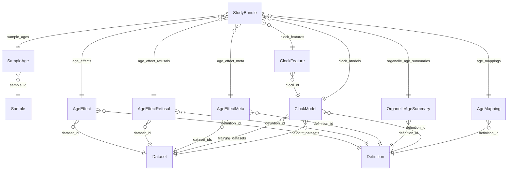

<!-- GENERATED by tools/build_docs.py from schema/study/aging.yaml. Do not edit by hand. -->

# dataRepo aging study layer (v0.3.0)

Tables the aging project adds on top of the generic core: normalized sample age, per-dataset age effects and their refusals, the cross-dataset pooled effect, organelle-level summaries, age clocks and cross-species age mapping. aging owns the content; every table is keyed on core identifiers and no core table is altered.

- **Schema id:** `https://w3id.org/datarepo/study/aging`
- **Source:** `schema/study/aging.yaml`
- **Imports:** the core schema ([core.md](core.md)). This layer only *adds* tables keyed on core IDs.

## Tables

| Table | Grain / purpose |
|---|---|
| [SampleAge](#sampleage) | Normalized age of one sample. NOT YET DEFINITION-BACKED (DATAREPO-5). The normalizer is SdrfAge (sdrf/mzLib #1326) and dataRepo only stores what it returns -- parsing an age string is not this repository's job (D1). Only about 160 of 1,236 curated SDRFs carry a real age (aging G12), so absence is common and is NA. No dataset in the instance populates this table today: the three ingested SDRFs carry only organism and biological replicate. |
| [AgeEffect](#ageeffect) | The estimated change in one measured quantity, for one feature, per DECADE of donor age, fitted WITHIN a single dataset, with its uncertainty and the evidence behind it. Content is `aging:DEF-AGE-EFFECT v1`; every column below is named by that definition. Four rules the shape enforces. PER DECADE, not per year: the datasets span 30-70 years and a per-year coefficient invites multiplication by a lifetime it was never fitted over. WITHIN ONE DATASET: raw intensities are not comparable across datasets (trap J3), so pooling happens in `age_effect_meta` over effect sizes only. AND A FIT THAT FAILED WRITES NO ROW: the reason goes to `age_effect_refusals`, because a null beta would make "no evidence" and "no effect" look the same. ONE ORGANISM, and never corrected for it (`aging:DEF-AGE-EFFECT v1.1`, aging 039/040): `beta` is per decade of chronological age within one organism. It is never expressed in lifespan fractions, life stages or human-equivalent years, and the decade is ten years for every organism -- a per-organism denominator is a lifespan correction wearing a different hat. Any cross-species comparison is a separate, named quantity computed at read time from `beta` and `age_mappings`, never a different meaning for this column. |
| [AgeEffectRefusal](#ageeffectrefusal) | One fit that was NOT performed, and why. This table is what answers trap J6: "give me the age effect for X in liver" is answered from here -- no liver dataset carries donor ages -- rather than by borrowing a number from another tissue. A refusal is a statement, not an absence, which is why it is a row. ASK: `aging:DEF-AGE-EFFECT v1` names this table and its `fit_refused` vocabulary but does not enumerate its columns, so the shape below is dataRepo's and is asked as DATAREPO-20. Its key mirrors AgeEffect's so a caller can look up the refusal for the exact fit they asked for; the feature columns are nullable because a `no_age_metadata` refusal is dataset-level and has no feature to name. |
| [AgeEffectMeta](#ageeffectmeta) | The pooled age effect for one feature ACROSS datasets. Content is `aging:DEF-AGE-EFFECT-META v1`; a separate table from AgeEffect because combining datasets is a different operation with different failure modes. The pooling is RANDOM-EFFECTS (DerSimonian-Laird), not fixed: these are different cohorts, tissues and instruments, and a fixed-effect model would assert one true effect. The stratification columns are refusals in disguise -- never pool across acquisition (DDA with DIA), across quant_method (label-free with TMT) or across tissue, because H6, I3 and D4 ask whether those AGREE and a pooled estimate would destroy the question -- and NEVER ACROSS ORGANISM (`aging:DEF-AGE-EFFECT-META v1.2` section 6.4, our G40), the strongest member of that family and the one first left unwritten because every dataset was human. It is a key column, not a stated invariant, because an invariant cannot be checked: today a UniProt accession is species-specific and happens to keep a human and a mouse effect apart, but an orthology-resolved feature id (`logs`) spans species by construction, and the moment one enters this table the accession stops being the guard. `n_datasets = 1` is a legitimate row carrying a null `i_squared`. It is not a meta-analysis; it is an honest statement that one dataset exists, which is the state of this repository for every tissue it holds. |
| [OrganelleAgeSummary](#organelleagesummary) | Meta-analytic age effect per COMPARTMENT across datasets. NOT YET DEFINITION-BACKED (DATAREPO-5): `aging:DEF-AGE-EFFECT-META v1` pools per feature, and rolling features up to a compartment is a further operation nobody has defined -- in particular how a protein in two compartments is counted. The shape is kept because it is the table section D's question ("do organelles age at different rates") reads, and it should be confirmed or replaced before it is filled. |
| [ClockModel](#clockmodel) | A trained age clock (R9). NOT YET DEFINITION-BACKED (DATAREPO-5); the shape is dataRepo's and the definition is aging's. An age clock is NOT an age effect: an effect is per feature, a clock is a model over many features (benchmark N1), and the definition is explicit that they are different tables for that reason. |
| [ClockFeature](#clockfeature) | One feature of a ClockModel with its weight. NOT YET DEFINITION-BACKED (DATAREPO-5). |
| [AgeMapping](#agemapping) | Cross-species age to life stage (R4). NOT YET DEFINITION-BACKED and NOT STARTED: rodent is in scope (D5) and has no age mapping. aging's, confirmed in their 039 (their requirement R4 assigned it to their stage 7 before rodents were in scope): an ANALYSIS CHOICE, not a fact about a sample, which is why it is neither sdrf's to curate nor ours to derive. dataRepo stores it as a versioned, definition-backed lookup. aging have said on the record that they will not publish a single scalar conversion: a mapping carries its source and its disagreement, or it is a refusal. |
| [StudyBundle](#studybundle) | The study layer's tables, named the same way `Bundle` names the core's. This is what `tools/build_tables.py` reads to generate `STUDY_TABLES`, so the layer's Parquet columns are the schema's and never a second hand-written copy. |

## How the tables connect

## SampleAge

Normalized age of one sample. NOT YET DEFINITION-BACKED (DATAREPO-5). The normalizer is SdrfAge (sdrf/mzLib #1326) and dataRepo only stores what it returns -- parsing an age string is not this repository's job (D1). Only about 160 of 1,236 curated SDRFs carry a real age (aging G12), so absence is common and is NA. No dataset in the instance populates this table today: the three ingested SDRFs carry only organism and biological replicate.

| Column | Type | Req | Meaning |
|---|---|---|---|
| `sample_id` | [Sample](#sample) | yes | Sample this row describes. |
| `age_raw` | `string` | yes | The SDRF value verbatim, so a normalizer change can be re-run against the source rather than against a previous normalization. |
| `age_years` | `float` |  | Normalized to years. NA when not parseable, which is not the same as no age being recorded -- `age_raw` distinguishes them. |
| `age_is_lower_bound` | `boolean` |  | True for a right-censored age such as '65+' or '>=90Y'. `aging:DEF-AGE-EFFECT v1` section 5 EXCLUDES these from a primary fit and counts them in `n_age_lower_bound`; they are never silently treated as the bound value, because the datasets most likely to carry them are the ones with the oldest donors. |
| `age_is_range` | `boolean` |  | True if the SDRF gives a range (e.g. 60-69Y). |
| `normalizer_version` | `string` | yes | Version of the age normalizer (SdrfAge) used. Two rows normalized by different versions are not comparable and this is how a caller can tell. |

## AgeEffect

The estimated change in one measured quantity, for one feature, per DECADE of donor age, fitted WITHIN a single dataset, with its uncertainty and the evidence behind it. Content is `aging:DEF-AGE-EFFECT v1`; every column below is named by that definition. Four rules the shape enforces. PER DECADE, not per year: the datasets span 30-70 years and a per-year coefficient invites multiplication by a lifetime it was never fitted over. WITHIN ONE DATASET: raw intensities are not comparable across datasets (trap J3), so pooling happens in `age_effect_meta` over effect sizes only. AND A FIT THAT FAILED WRITES NO ROW: the reason goes to `age_effect_refusals`, because a null beta would make "no evidence" and "no effect" look the same. ONE ORGANISM, and never corrected for it (`aging:DEF-AGE-EFFECT v1.1`, aging 039/040): `beta` is per decade of chronological age within one organism. It is never expressed in lifespan fractions, life stages or human-equivalent years, and the decade is ten years for every organism -- a per-organism denominator is a lifespan correction wearing a different hat. Any cross-species comparison is a separate, named quantity computed at read time from `beta` and `age_mappings`, never a different meaning for this column.

| Column | Type | Req | Meaning |
|---|---|---|---|
| `dataset_id` | [Dataset](#dataset) | yes | Dataset the fit was performed within. |
| `organism` | `uriorcurie` | yes | NCBITaxon term of the organism the fit ran over. REQUIRED and denormalised (`aging:DEF-AGE-EFFECT v1.1` section 6.4): a dataset has one organism, so this is functionally dependent on `dataset_id`, but the pooling guard in `age_effect_meta` has to be checkable without a join, and a guard that needs a join is a guard somebody will skip. Not part of this table's key, because `dataset_id` already is (G40). |
| `age_centre_years` | `float` | yes | The age the model was centred on, in years: `age_decades = (age_years - age_centre_years) / 10`. REQUIRED, with no n/a (`aging:DEF-AGE-EFFECT v1.1`, aging 040 section 3). It was a literal 50 in the model formula, a human constant that put every mouse observation near -4.8 decades. Centring does not change `beta`, only the intercept -- but the intercept and the knots of a `spline` or `breakpoint` fit are expressed relative to it, so a row with no centre cannot have either interpreted. 50 for human. |
| `feature_type` | [FeatureType](#featuretype) | yes | Which table feature_id points into. ASK: the definition's section 4 writes `glycosite`, which the core FeatureType enum does not have -- it has `glycopeptide`. Using the core enum rather than forking it, and asked as DATAREPO-20. |
| `feature_id` | `string` | yes | Identifier of the feature in the table named by feature_type. |
| `response` | [AgeResponse](#ageresponse) | yes | What changes with age. Part of the key. |
| `estimator` | [AgeEstimator](#ageestimator) | yes | Which estimator produced the response. Part of the key, because count- and intensity-based occupancy must never be averaged. |
| `quant_basis` | [QuantBasis](#quantbasis) | yes | Whether MBR-transferred peaks counted as present. Part of the key: both are computed and both are stored, so DEF-Q4 being open does not block the fit. |
| `model_form` | [ModelForm](#modelform) | yes | Linear, spline or breakpoint. Part of the key. |
| `stratum` | `string` | yes | Which samples the fit ran over: `all`, `sex=female`, `sex=male` (D13), or `incl_censored` for the sensitivity fit that includes right-censored ages at face value (definition section 5). ASK: left as a string rather than an enum because the definition's own section 5 adds a value its section 2 table does not list, so the vocabulary is demonstrably open. DATAREPO-20 asks whether to close it. |
| `beta` | `float` | yes | The coefficient on `age_decades = (age_years - age_centre_years) / 10`: change PER DECADE of chronological age, within one organism, in the units of the response's transform -- log2 fold change for abundance and isoform_ratio, logit change for the fractions. Required, because a row exists only when a fit succeeded. |
| `se` | `float` | yes | Standard error of `beta`. REQUIRED: the definition's section 4 says a beta without an se is not an age effect. |
| `ci_low` | `float` |  | Lower bound of the confidence interval on `beta`. |
| `ci_high` | `float` |  | Upper bound of the confidence interval on `beta`. |
| `p_value` | `float` |  | Unadjusted p-value for `beta`. (range 0..1) |
| `q_value` | `float` |  | Benjamini-Hochberg q-value WITHIN (dataset_id, response, estimator, quant_basis, model_form, stratum). The family is the set of features tested together and nothing else, so a q-value here may not be compared with one from another family. (range 0..1) |
| `n_samples` | `integer` | yes | Samples that entered the fit. At least 8, or no row was written. |
| `n_observed` | `integer` |  | Samples with a non-missing value for this feature. |
| `n_missing` | `integer` |  | Samples with a missing value. Missing is NA and is OMITTED from the fit, never imputed -- imputation is a modelling choice with its own definition and it is not this one. |
| `age_min` | `float` |  | Youngest donor age in the fit, in years. |
| `age_max` | `float` |  | Oldest donor age in the fit, in years. |
| `age_span_years` | `float` | yes | The span the effect was fitted over. REQUIRED, and it is the column that stops a reader treating a per-decade effect from a 12-year span as evidence about a lifetime. |
| `n_age_lower_bound` | `integer` |  | How many donor ages were right-censored. Excluded from a primary fit; see `stratum = incl_censored` for the sensitivity fit. |
| `covariates` | `string` | yes | The terms ACTUALLY FITTED, semicolon-separated. REQUIRED, and read strictly: a row whose covariates do not list a term did not adjust for it, whatever the protocol said. `sex` is not optional where the dataset has two levels with at least two samples each, and a dataset with more than one condition must carry a disease/condition term or the age effect absorbs the group difference. |
| `normalization` | `string` | yes | What was applied before fitting, e.g. `median_log2_per_run`. Required because `DEF-PROT-INT` is un-normalized when FlashLFQ's Normalize is off, which is what every run in the instance used, so a fit that does not say what it normalized cannot be read. |
| `method` | `string` | yes | The engine that fitted the model, e.g. `msqrob2`. |
| `method_version` | `string` | yes | Version of that engine. Two rows fitted by different engines are not comparable, and this is how a caller can tell. |
| `n_covering_psms_median` | `float` |  | modified_fraction rows only. Median PSM depth covering the site across samples -- QuantProject's own recommended filter, and what separates a real occupancy change from a depth artifact. |
| `intensity_is_floor_frac` | `float` |  | modified_fraction + estimator=intensity only. Fraction of the observations that were DEF-OCC-INT-ZERO floors rather than measured values. A row where this is high is mostly censored data. (range 0..1) |
| `mbr_kept_frac` | `float` |  | Fraction of the values that came from a match-between-runs transferred peak. (range 0..1) |
| `definition_id` | [Definition](#definition) | yes | `aging:DEF-AGE-EFFECT v1.1` (v1.1 added `organism` and `age_centre_years`). A change to the model, the covariate rule, the transform or the section 5 thresholds is a new version, not an edit. |

## AgeEffectRefusal

One fit that was NOT performed, and why. This table is what answers trap J6: "give me the age effect for X in liver" is answered from here -- no liver dataset carries donor ages -- rather than by borrowing a number from another tissue. A refusal is a statement, not an absence, which is why it is a row. ASK: `aging:DEF-AGE-EFFECT v1` names this table and its `fit_refused` vocabulary but does not enumerate its columns, so the shape below is dataRepo's and is asked as DATAREPO-20. Its key mirrors AgeEffect's so a caller can look up the refusal for the exact fit they asked for; the feature columns are nullable because a `no_age_metadata` refusal is dataset-level and has no feature to name.

| Column | Type | Req | Meaning |
|---|---|---|---|
| `dataset_id` | [Dataset](#dataset) | yes | Dataset the fit would have run within. |
| `organism` | `uriorcurie` | yes | NCBITaxon term of the organism the fit would have run over. REQUIRED and denormalised, as on `age_effects` (aging 042 section 2): a refusal row is what someone reads when asking why there is no mouse estimate for a feature, and if answering that needs a join back to `datasets` it will sometimes be answered wrongly. Not part of the key, because `dataset_id` already is. |
| `feature_type` | [FeatureType](#featuretype) |  | Null for a dataset-level refusal such as no_age_metadata. |
| `feature_id` | `string` |  | Null for a dataset-level refusal such as no_age_metadata. |
| `response` | [AgeResponse](#ageresponse) | yes | The response that was not fitted. |
| `estimator` | [AgeEstimator](#ageestimator) | yes | The estimator that was not used. |
| `quant_basis` | [QuantBasis](#quantbasis) | yes | The quantification basis that was not used. |
| `model_form` | [ModelForm](#modelform) | yes | The model form that was not fitted. |
| `stratum` | `string` | yes | The stratum that was not fitted. |
| `fit_refused` | [FitRefusal](#fitrefusal) | yes | Why. Closed list from the definition's section 5. |
| `n_samples` | `integer` |  | Samples available, where that is what failed. |
| `n_observed` | `integer` |  | Non-missing values available, where that is what failed. |
| `n_distinct_ages` | `integer` |  | Distinct donor ages available, where that is what failed. |
| `age_span_years` | `float` |  | Age span available, where that is what failed. |
| `definition_id` | [Definition](#definition) | yes | `aging:DEF-AGE-EFFECT v1`, whose section 5 sets the thresholds this row failed. |

## AgeEffectMeta

The pooled age effect for one feature ACROSS datasets. Content is `aging:DEF-AGE-EFFECT-META v1`; a separate table from AgeEffect because combining datasets is a different operation with different failure modes. The pooling is RANDOM-EFFECTS (DerSimonian-Laird), not fixed: these are different cohorts, tissues and instruments, and a fixed-effect model would assert one true effect. The stratification columns are refusals in disguise -- never pool across acquisition (DDA with DIA), across quant_method (label-free with TMT) or across tissue, because H6, I3 and D4 ask whether those AGREE and a pooled estimate would destroy the question -- and NEVER ACROSS ORGANISM (`aging:DEF-AGE-EFFECT-META v1.2` section 6.4, our G40), the strongest member of that family and the one first left unwritten because every dataset was human. It is a key column, not a stated invariant, because an invariant cannot be checked: today a UniProt accession is species-specific and happens to keep a human and a mouse effect apart, but an orthology-resolved feature id (`logs`) spans species by construction, and the moment one enters this table the accession stops being the guard. `n_datasets = 1` is a legitimate row carrying a null `i_squared`. It is not a meta-analysis; it is an honest statement that one dataset exists, which is the state of this repository for every tissue it holds.

| Column | Type | Req | Meaning |
|---|---|---|---|
| `organism` | `uriorcurie` | yes | NCBITaxon term. FIRST component of the key and a hard stratification (`aging:DEF-AGE-EFFECT-META v1.2` section 6.4): every contributing `age_effects` row carries this organism, and a pooled estimate over two organisms is not written. Pooling across species on purpose is a different, named operation that does not exist yet. |
| `feature_type` | [FeatureType](#featuretype) | yes | Which kind of feature this row pools. ASK (DATAREPO-20): the definition's section 6 key omits feature_type, but without it `feature_id` cannot be interpreted -- and a dataset-scoped identifier such as a protein_group_id cannot be a cross-dataset key at all, so the cross-dataset identity of a feature is itself the question. |
| `feature_id` | `string` | yes | Identifier of the feature, in whatever vocabulary is cross-dataset for its type. ASK (DATAREPO-20): see feature_type. |
| `response` | [AgeResponse](#ageresponse) | yes | What changes with age. Part of the key. |
| `estimator` | [AgeEstimator](#ageestimator) | yes | Part of the key. |
| `quant_basis` | [QuantBasis](#quantbasis) | yes | Part of the key. |
| `stratum` | `string` | yes | Part of the key. |
| `tissue` | `uriorcurie` | yes | UBERON term. Part of the key, and a hard stratification: D4 asks whether the lysosome shows the same trend in brain as in muscle, which is two rows. |
| `acquisition` | [Acquisition](#acquisition) | yes | Part of the key, and a hard stratification: H6 and I3 ask whether DDA and DIA agree. |
| `quant_method` | [QuantMethod](#quantmethod) | yes | Part of the key, and a hard stratification: label-free and TMT are never pooled. |
| `beta_meta` | `float` | yes | Random-effects (DerSimonian-Laird) pooled effect, per decade, in the response's transform units. |
| `se_meta` | `float` | yes | Standard error of the pooled effect. Required for the same reason `se` is on AgeEffect. |
| `ci_low` | `float` |  | Lower bound of the confidence interval on `beta_meta`. |
| `ci_high` | `float` |  | Upper bound of the confidence interval on `beta_meta`. |
| `q_meta` | `float` |  | Benjamini-Hochberg across features within the same stratum. (range 0..1) |
| `n_datasets` | `integer` | yes | How many datasets contributed. |
| `dataset_ids` | [Dataset](#dataset) [ ] | yes | WHICH datasets contributed. C3 and D1 ask for an effect seen in at least three datasets and need the list, not the count. |
| `i_squared` | `float` |  | I-squared heterogeneity across datasets. Null when n_datasets = 1, which is not a defect. (range 0..1) |
| `tau2` | `float` |  | Between-dataset variance. H1's forest plot is made of this and i_squared. |
| `n_direction_agree` | `integer` |  | Contributing datasets whose effect has the same sign as the pooled one. H6 and I3 want direction agreement rather than a pooled p-value. |
| `n_direction_disagree` | `integer` |  | Contributing datasets whose effect has the opposite sign. |
| `leave_one_out_max_delta` | `float` |  | The largest change in `beta_meta` from dropping any single dataset. C2 asks whether the age effect is driven by one dataset, and this answers it as a number rather than a judgement. Null when n_datasets = 1. |
| `definition_id` | [Definition](#definition) | yes | `aging:DEF-AGE-EFFECT-META v1.2` (v1.2 added `organism` to the key and the never-pool-across-organism rule). |

## OrganelleAgeSummary

Meta-analytic age effect per COMPARTMENT across datasets. NOT YET DEFINITION-BACKED (DATAREPO-5): `aging:DEF-AGE-EFFECT-META v1` pools per feature, and rolling features up to a compartment is a further operation nobody has defined -- in particular how a protein in two compartments is counted. The shape is kept because it is the table section D's question ("do organelles age at different rates") reads, and it should be confirmed or replaced before it is filled.

| Column | Type | Req | Meaning |
|---|---|---|---|
| `compartment` | `uriorcurie` | yes | GO-CC term, from go's map. The organelle map belongs to `go` (D1). |
| `organism` | `uriorcurie` | yes | NCBITaxon term. |
| `organism_part` | `uriorcurie` |  | UBERON; NA = all tissues. |
| `response` | [AgeResponse](#ageresponse) | yes | What changes with age. |
| `definition_id` | [Definition](#definition) | yes | Definition ID of the roll-up that produced the estimate. There is not one yet. |
| `n_datasets` | `integer` | yes | Datasets contributing to the summary. |
| `n_proteins` | `integer` |  | Proteins contributing to the summary. |
| `estimate` | `float` |  | Effect estimate (units set by the definition). |
| `standard_error` | `float` |  | Standard error of the estimate. |
| `q_value` | `float` |  | Adjusted p-value across compartments. (range 0..1) |
| `heterogeneity_i2` | `float` |  | I-squared heterogeneity across datasets (0-1). (range 0..1) |

## ClockModel

A trained age clock (R9). NOT YET DEFINITION-BACKED (DATAREPO-5); the shape is dataRepo's and the definition is aging's. An age clock is NOT an age effect: an effect is per feature, a clock is a model over many features (benchmark N1), and the definition is explicit that they are different tables for that reason.

| Column | Type | Req | Meaning |
|---|---|---|---|
| `clock_id` | `string` | key | Stable ID of the clock. |
| `definition_id` | [Definition](#definition) | yes | Owner's definition ID giving this model its meaning. |
| `feature_level` | `string` |  | protein, ptm_site, proteoform or mixed (N1). |
| `training_datasets` | [Dataset](#dataset) [ ] |  | Datasets used to train the clock. |
| `cv_mae_years` | `float` |  | Cross-validated mean absolute error in years. |
| `heldout_mae_years` | `float` |  | Mean absolute error on held-out datasets, in years. A clock with no held-out error has not been validated, and the two columns are separate so that cannot be hidden. |
| `heldout_datasets` | [Dataset](#dataset) [ ] |  | Datasets held out for validation. |

## ClockFeature

One feature of a ClockModel with its weight. NOT YET DEFINITION-BACKED (DATAREPO-5).

| Column | Type | Req | Meaning |
|---|---|---|---|
| `clock_id` | [ClockModel](#clockmodel) | yes | Clock this feature belongs to. |
| `feature_type` | [FeatureType](#featuretype) | yes | Which table feature_id points into. |
| `feature_id` | `string` | yes | Identifier of the feature in the table named by feature_type. |
| `weight` | `float` | yes | Model weight of the feature. |

## AgeMapping

Cross-species age to life stage (R4). NOT YET DEFINITION-BACKED and NOT STARTED: rodent is in scope (D5) and has no age mapping. aging's, confirmed in their 039 (their requirement R4 assigned it to their stage 7 before rodents were in scope): an ANALYSIS CHOICE, not a fact about a sample, which is why it is neither sdrf's to curate nor ours to derive. dataRepo stores it as a versioned, definition-backed lookup. aging have said on the record that they will not publish a single scalar conversion: a mapping carries its source and its disagreement, or it is a refusal.

| Column | Type | Req | Meaning |
|---|---|---|---|
| `organism` | `uriorcurie` | yes | NCBITaxon term the mapping applies to. |
| `age_from` | `float` | yes | Start of the age band (inclusive). |
| `age_to` | `float` | yes | End of the age band (exclusive). |
| `age_unit` | `string` | yes | Unit of age_from and age_to (days, weeks, months, years). |
| `life_stage` | `string` | yes | Life-stage label, e.g. young adult, middle age, old. |
| `human_equivalent_years` | `float` |  | Approximate human-equivalent age in years. |
| `definition_id` | [Definition](#definition) | yes | Owner's definition ID giving this mapping its meaning. |

## StudyBundle

The study layer's tables, named the same way `Bundle` names the core's. This is what `tools/build_tables.py` reads to generate `STUDY_TABLES`, so the layer's Parquet columns are the schema's and never a second hand-written copy.

| Column | Type | Req | Meaning |
|---|---|---|---|
| `sample_ages` | [SampleAge](#sampleage) [ ] |  | Rows of the sample_ages table. |
| `age_effects` | [AgeEffect](#ageeffect) [ ] |  | Rows of the age_effects table. |
| `age_effect_refusals` | [AgeEffectRefusal](#ageeffectrefusal) [ ] |  | Rows of the age_effect_refusals table. |
| `age_effect_meta` | [AgeEffectMeta](#ageeffectmeta) [ ] |  | Rows of the age_effect_meta table. |
| `organelle_age_summaries` | [OrganelleAgeSummary](#organelleagesummary) [ ] |  | Rows of the organelle_age_summaries table. |
| `clock_models` | [ClockModel](#clockmodel) [ ] |  | Rows of the clock_models table. |
| `clock_features` | [ClockFeature](#clockfeature) [ ] |  | Rows of the clock_features table. |
| `age_mappings` | [AgeMapping](#agemapping) [ ] |  | Rows of the age_mappings table. |

## Controlled vocabularies

### AgeResponse

What changes with age. `aging:DEF-AGE-EFFECT v1` section 1: an age effect is always OF a named response, because a protein's abundance and a site's modified fraction are different age effects on the same molecule and the point of this repository is that they can disagree. Never one column.

| Value | Meaning |
|---|---|
| `abundance` | log2 intensity. Benchmark D1, K1. |
| `modified_fraction` | PTM occupancy, logit-transformed. Benchmark K1, K13. |
| `isoform_ratio` | log2 ratio between isoforms. Benchmark O4. |
| `glycoform_fraction` | logit-transformed glycoform share. Benchmark T3. |

### AgeEstimator

Which estimator produced the response, where a response has more than one. QuantProject 017: count-based and intensity-based stoichiometry differ about threefold and MUST NEVER be averaged, so they are separate rows rather than one number.

| Value | Meaning |
|---|---|
| `count` | QuantProject:DEF-OCC-COUNT. |
| `intensity` | QuantProject:DEF-OCC-INT. |
| `n/a` | The response has only one estimator, e.g. abundance. |

### QuantBasis

Whether a match-between-runs transferred peak was counted as present. `DEF-Q4` asks which is right and the user has not ruled; the definition's answer is to compute both and store both rows, so the unanswered question becomes a column the repository can be queried on (H8+).

| Value | Meaning |
|---|---|
| `msms_only` | Only peaks with an MS2 identification in that run. |
| `mbr_kept` | Transferred peaks counted as present. |

### ModelForm

The shape fitted in age. H7+ asks whether the trend is linear or has a breakpoint.

| Value | Meaning |
|---|---|
| `linear` |  |
| `spline` |  |
| `breakpoint` |  |

### FitRefusal

Why a fit was not performed. Closed list, from `aging:DEF-AGE-EFFECT v1` section 5. When a minimum-evidence requirement fails, NO row is written to `age_effect` -- not a row with a null beta -- because an absent age effect and an age effect of zero are different facts.

| Value | Meaning |
|---|---|
| `n_too_small` | Fewer than 8 samples in the fit. |
| `age_span_too_narrow` | Age span under 10 years; a per-decade coefficient from less than a decade is fiction. |
| `too_few_distinct_ages` | Fewer than 5 distinct ages; a group comparison wearing a regression's clothes. |
| `too_missing` | Non-missing values under 60% of samples, or under 6. |
| `batch_confounded` | Batch is confounded with age and the dataset carries no batch term. |
| `no_age_metadata` | The dataset carries no donor ages at all. This is the value that answers trap J6. |
