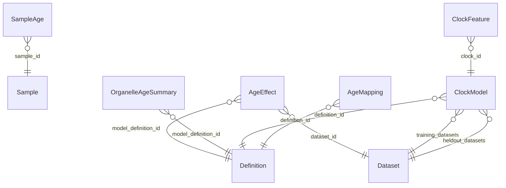

<!-- GENERATED by tools/build_docs.py from schema/study/aging.yaml. Do not edit by hand. -->

# dataRepo aging study layer (v0.0.1)

Tables the aging project adds on top of the generic core: normalized sample age, per-dataset age effects, organelle-level summaries, age clocks and cross-species age mapping. aging owns the content; every table is keyed on core identifiers and no core table is altered.

- **Schema id:** `https://w3id.org/datarepo/study/aging`
- **Source:** `schema/study/aging.yaml`
- **Imports:** the core schema ([core.md](core.md)). This layer only *adds* tables keyed on core IDs.

## Tables

| Table | Grain / purpose |
|---|---|
| [SampleAge](#sampleage) | Normalized age of one sample. Normalizer: SdrfAge (sdrf/mzLib #1326); dataRepo only stores it. Only ~160 of 1,236 curated SDRFs carry a real age (aging G12), so absence is common and is NA. |
| [AgeEffect](#ageeffect) | Estimated association of one feature with age in one dataset under one model (aging stage 7, R/msqrob2). feature_type + feature_id point into core tables. |
| [OrganelleAgeSummary](#organelleagesummary) | Meta-analytic age effect per compartment across datasets (precomputed from AgeEffect). |
| [ClockModel](#clockmodel) | A trained age clock (R9, aging's stage after stage 7). |
| [ClockFeature](#clockfeature) | One feature of a ClockModel with its weight. |
| [AgeMapping](#agemapping) | Cross-species age to life stage (R4). aging stage 7 owns it as a versioned, definition-backed lookup; dataRepo stores it. |

## How the tables connect

## SampleAge

Normalized age of one sample. Normalizer: SdrfAge (sdrf/mzLib #1326); dataRepo only stores it. Only ~160 of 1,236 curated SDRFs carry a real age (aging G12), so absence is common and is NA.

| Column | Type | Req | Meaning |
|---|---|---|---|
| `sample_id` | [Sample](#sample) | yes | Sample this row describes. |
| `age_raw` | `string` | yes | The SDRF value verbatim. |
| `age_years` | `float` |  | Normalized to years. NA when not parseable. |
| `age_is_lower_bound` | `boolean` |  | e.g. '65+' or '>80'. |
| `age_is_range` | `boolean` |  | True if the SDRF gives a range (e.g. 60-69Y). |
| `normalizer_version` | `string` | yes | Version of the age normalizer (SdrfAge) used. |

## AgeEffect

Estimated association of one feature with age in one dataset under one model (aging stage 7, R/msqrob2). feature_type + feature_id point into core tables.

| Column | Type | Req | Meaning |
|---|---|---|---|
| `dataset_id` | [Dataset](#dataset) | yes | Dataset this row belongs to (ProteomeXchange accession). |
| `feature_type` | [FeatureType](#featuretype) | yes | Which table feature_id points into. |
| `feature_id` | `string` | yes | Identifier of the feature in the table named by feature_type. |
| `response` | `string` | yes | What changes with age: abundance, modified_fraction (K1, K13), isoform_ratio (O4), glycoform_fraction (T3). |
| `model_definition_id` | [Definition](#definition) | yes | Definition ID of the statistical model that produced the estimate. |
| `estimate` | `float` |  | Effect estimate (units set by the model definition). |
| `standard_error` | `float` |  | Standard error of the estimate. |
| `p_value` | `float` |  | Unadjusted p-value. (range 0..1) |
| `q_value` | `float` |  | False discovery rate q-value (0-1). (range 0..1) |
| `n_samples` | `integer` |  | Samples that entered the model. |

## OrganelleAgeSummary

Meta-analytic age effect per compartment across datasets (precomputed from AgeEffect).

| Column | Type | Req | Meaning |
|---|---|---|---|
| `compartment` | `uriorcurie` | yes | GO-CC term, from go's map. |
| `organism` | `uriorcurie` | yes | NCBITaxon (D14). |
| `organism_part` | `uriorcurie` |  | UBERON; NA = all tissues. |
| `response` | `string` | yes | What changes with age (same vocabulary as AgeEffect.response). |
| `model_definition_id` | [Definition](#definition) | yes | Definition ID of the statistical model that produced the estimate. |
| `n_datasets` | `integer` | yes | Datasets contributing to the summary. |
| `n_proteins` | `integer` |  | Proteins contributing to the summary. |
| `estimate` | `float` |  | Effect estimate (units set by the model definition). |
| `standard_error` | `float` |  | Standard error of the estimate. |
| `q_value` | `float` |  | Adjusted p-value across compartments. (range 0..1) |
| `heterogeneity_i2` | `float` |  | I-squared heterogeneity across datasets (0-1). (range 0..1) |

## ClockModel

A trained age clock (R9, aging's stage after stage 7).

| Column | Type | Req | Meaning |
|---|---|---|---|
| `clock_id` | `string` | key | Stable ID of the clock. |
| `definition_id` | [Definition](#definition) | yes | Owner's definition ID giving this number its meaning. |
| `feature_level` | `string` |  | protein, ptm_site, proteoform, mixed (N1). |
| `training_datasets` | [Dataset](#dataset) [ ] |  | Datasets used to train the clock. |
| `cv_mae_years` | `float` |  | Cross-validated mean absolute error in years. |
| `heldout_mae_years` | `float` |  | Mean absolute error on held-out datasets, in years. |
| `heldout_datasets` | [Dataset](#dataset) [ ] |  | Datasets held out for validation. |

## ClockFeature

One feature of a ClockModel with its weight.

| Column | Type | Req | Meaning |
|---|---|---|---|
| `clock_id` | [ClockModel](#clockmodel) | yes | Clock this feature belongs to. |
| `feature_type` | [FeatureType](#featuretype) | yes | Which table feature_id points into. |
| `feature_id` | `string` | yes | Identifier of the feature in the table named by feature_type. |
| `weight` | `float` | yes | Model weight of the feature. |

## AgeMapping

Cross-species age to life stage (R4). aging stage 7 owns it as a versioned, definition-backed lookup; dataRepo stores it.

| Column | Type | Req | Meaning |
|---|---|---|---|
| `organism` | `uriorcurie` | yes | NCBITaxon term the mapping applies to. |
| `age_from` | `float` | yes | Start of the age band (inclusive). |
| `age_to` | `float` | yes | End of the age band (exclusive). |
| `age_unit` | `string` | yes | Unit of age_from and age_to (days, weeks, months, years). |
| `life_stage` | `string` | yes | Life-stage label, e.g. young adult, middle age, old. |
| `human_equivalent_years` | `float` |  | Approximate human-equivalent age in years. |
| `definition_id` | [Definition](#definition) | yes | Owner's definition ID giving this number its meaning. |
